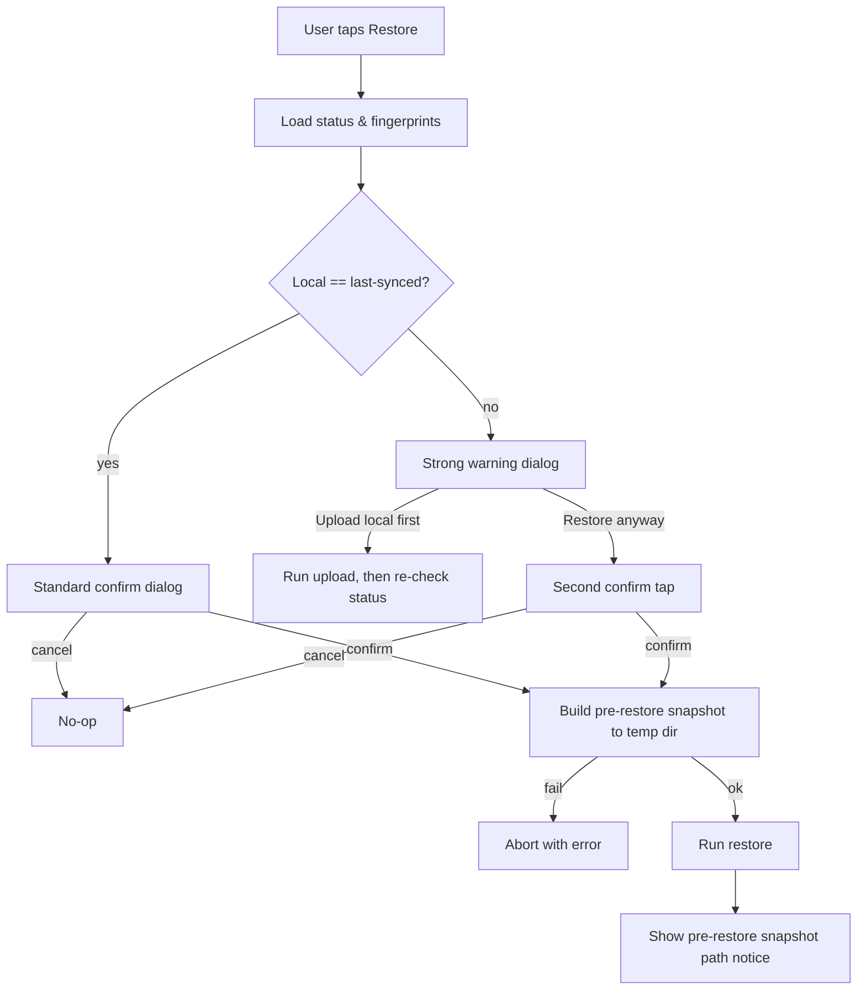
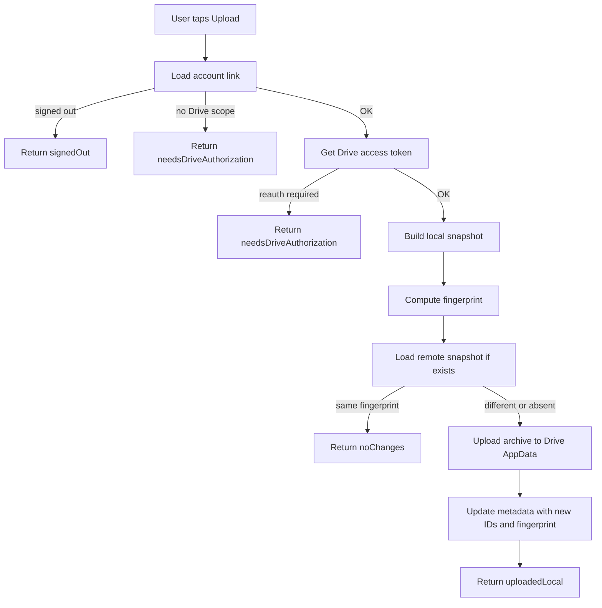
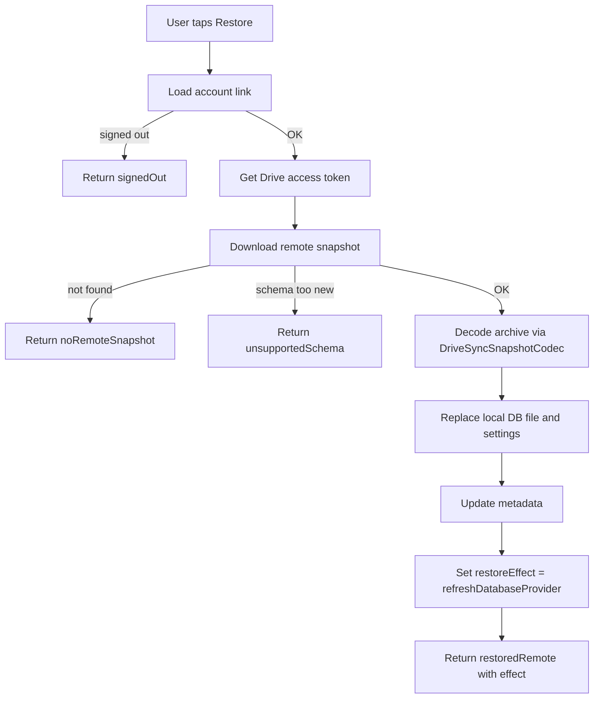

# Account and Drive Sync

This document covers two tightly coupled features:

1. **Google account linking** — optional sign-in with a Google account.
2. **Google Drive sync** — manual backup/restore of local data to user's Google Drive AppData
   folder.

Drive sync is unavailable without a linked Google account with Drive AppData authorization. Both are
optional; the app works fully offline as a guest.

## Source files to inspect

### Account

- `lib/domain/entities/cloud_account_link.dart` (CloudAccountLink, CloudProvider,
  DriveAuthorizationState, AccountLinkStatus, googleDriveAppDataScope)
- `lib/domain/entities/account_database_context.dart` (AccountDatabaseContext,
  AccountDatabaseContextResolver, GuestDatabaseSignInChoice)
- `lib/domain/repositories/cloud_account_repository.dart`
- `lib/domain/services/google_account_auth_service.dart` (GoogleAccountAuthService,
  GoogleAccountAuthResult, DriveAccessTokenResult)
- `lib/domain/usecases/cloud_account_usecases.dart`
- `lib/data/settings/cloud_account_store.dart` (CloudAccountStore — SharedPreferences-backed)
- `lib/core/config/google_oauth_config.dart`
- `lib/presentation/features/settings/screens/account_settings_screen.dart`
- `lib/presentation/features/settings/viewmodels/account_settings_viewmodel.dart`
- `lib/presentation/features/settings/widgets/account_settings_group.dart`
- `lib/presentation/features/settings/widgets/google_account_web_button*.dart`

### Drive sync

- `lib/domain/entities/drive_sync_models.dart` (DriveSyncManifest, DriveSyncSnapshot,
  DriveSyncRemoteSnapshot, DriveSyncMetadata, DriveSyncStatus, DriveSyncRunResult, all status/action
  enums)
- `lib/domain/repositories/drive_sync_repository.dart`
- `lib/domain/usecases/drive_sync_usecases.dart` (LoadDriveSyncStatusUseCase,
  UploadLocalDriveSnapshotUseCase, RestoreDriveSnapshotUseCase)
- `lib/data/repositories/google_drive_sync_repository.dart`
- `lib/data/repositories/google_drive_sync_repository_helpers.dart`
- `lib/data/sync/google_drive_app_data_client.dart` (Drive AppData REST client)
- `lib/data/sync/local_database_snapshot_gateway_contract.dart` (interface — `exportDatabase()`,
  `restoreDatabase()`, `currentSchemaVersion`)
- `lib/data/sync/local_database_snapshot_gateway_io.dart` (mobile + desktop with file IO; uses
  `package:path_provider` temp directory)
- `lib/data/sync/local_database_snapshot_gateway_web.dart` (browser; uses `WasmDatabase` +
  `sqlite3.wasm` + `drift_worker.dart.js`)
- `lib/data/sync/local_database_snapshot_gateway_stub.dart` (fallback for platforms without sqlite
  support — throws `UnsupportedError`)
- `lib/data/sync/app_settings_snapshot_store.dart`
- `lib/data/sync/drive_sync_metadata_store.dart` (SharedPreferences-backed)
- `lib/data/sync/drive_sync_snapshot_codec.dart`
- `lib/data/sync/drive_sync_json.dart`
- `lib/app/services/drive_sync_runtime_effects.dart`
- `lib/presentation/features/settings/viewmodels/drive_sync_settings_viewmodel.dart`
- `lib/presentation/features/settings/widgets/drive_sync_settings_group.dart`

## Provider

Only Google is supported. `CloudProvider` enum has a single value: `google`. The Drive AppData scope
is the only OAuth scope requested.

```text
googleDriveAppDataScope = 'https://www.googleapis.com/auth/drive.appdata'
```

AppData scope means: the app sees only files it created in a hidden per-app folder. Cannot read
user's other Drive files. Cannot be browsed by user via Drive UI directly.

## Storage of account link

`CloudAccountLink` is persisted in **SharedPreferences** (NOT Drift), via `CloudAccountStore`. Key:
`AppConstants.sharedPrefsCloudAccountLinkKey`.

Stored fields:

| Field                     | Type           | Purpose                                                                    |
|---------------------------|----------------|----------------------------------------------------------------------------|
| `schemaVersion`           | int            | Currently `1`. Mismatched versions return null on load (re-link required). |
| `provider`                | enum           | Only `google` currently.                                                   |
| `subjectId`               | string         | Google subject id (`sub` claim). Stable identifier.                        |
| `email`                   | string         | Email at time of link.                                                     |
| `displayName`             | string?        | Optional display name.                                                     |
| `photoUrl`                | string?        | Optional profile photo URL.                                                |
| `grantedScopes`           | Set\<string\>  | OAuth scopes the user actually granted.                                    |
| `driveAuthorizationState` | enum           | `notRequested`, `authorized`, `authorizationRequired`, `denied`.           |
| `linkedAt`                | int (epoch ms) | First link time. Preserved across re-sign-in for same `subjectId`.         |
| `lastSignedInAt`          | int (epoch ms) | Updated each successful auth.                                              |

Corruption-tolerant: malformed payload returns `null`, treated as not linked.

## Account link statuses

`AccountLinkStatus`:

| Status                    | Meaning                                                         |
|---------------------------|-----------------------------------------------------------------|
| `signedOut`               | No link or user signed out.                                     |
| `signedIn`                | Linked and Drive authorized.                                    |
| `needsDriveAuthorization` | Linked but Drive scope missing/revoked.                         |
| `unconfigured`            | App lacks OAuth config for current platform.                    |
| `unsupported`             | Platform does not support Google sign-in.                       |
| `error`                   | Last operation failed. Technical message in `technicalMessage`. |

Driver: `CloudAccountLink.driveAppDataAuthorized` returns true only when
`driveAuthorizationState == authorized` AND `grantedScopes` contains the AppData scope.

## Account use cases

| Use case                                | Purpose                                           |
|-----------------------------------------|---------------------------------------------------|
| `LoadCloudAccountLinkUseCase`           | Read current link from store.                     |
| `RestoreGoogleAccountUseCase`           | Silent re-auth on app start (lightweight, no UI). |
| `SignInGoogleAccountUseCase`            | Interactive sign-in + Drive scope grant.          |
| `AuthorizeGoogleDriveUseCase`           | Add Drive scope to existing link.                 |
| `SignOutGoogleAccountUseCase`           | Local sign-out, keep tokens revocable.            |
| `DisconnectGoogleAccountUseCase`        | Revoke server-side consent, clear local link.     |
| `PersistGoogleAccountAuthResultUseCase` | Persist auth result from external trigger.        |
| `GetDriveAppDataAccessTokenUseCase`     | Get a Drive access token for an API call.         |

Sign-out vs disconnect:

- **Sign-out**: clears local session only. Next sign-in does not re-prompt for consent.
- **Disconnect**: calls `GoogleSignIn.disconnect()` to revoke server-side. Next sign-in re-prompts
  for Drive scope.

## Per-account database isolation

This is the most important architectural detail and easy to miss.

The Drift database file name is parameterized by account:

| Account context | Database name                                            |
|-----------------|----------------------------------------------------------|
| Guest (no link) | `{AppConstants.localDatabaseName}_guest`                 |
| Google account  | `{AppConstants.localDatabaseName}_{normalizedSubjectId}` |

Source: `AccountDatabaseContext.guest()` / `AccountDatabaseContext.googleAccount(subjectId)`.

`subjectId` is normalized: non-alphanumeric chars (except `_-`) become `_`. Empty normalized id
throws `ArgumentError`.

### Guest → signed-in transition

When a guest signs into a Google account, the user chooses via `GuestDatabaseSignInChoice`:

| Choice                       | Behavior                                                              |
|------------------------------|-----------------------------------------------------------------------|
| `attachGuestData`            | Migrate guest data into the new account database (one-time merge).    |
| `createFreshAccountDatabase` | Start the account database empty; guest data remains in the guest DB. |

Resolved via `AccountDatabaseContextResolver.resolveGuestSignIn`. Result is
`AccountDatabaseTransition` with `shouldAttachGuestData` flag.

### Sign-out behavior

Sign-out drops back to guest context. The account's database file remains on disk for next sign-in.
Guest database resumes as the active one.

### Rules

- The app MUST never write account A's data into account B's database.
- `AccountDatabaseContext.belongsTo(link)` verifies a context matches a link before opening the
  database for that account.
- Switching accounts MUST close the current `AppDatabase` and open the next account's database file.

## Platform snapshot gateways

Snapshot read/write is the only sync surface that requires platform-specific implementation. The
contract is the same across platforms; only how bytes are read from / written to the local Drift
database differs.

| Platform                                                                                            | Implementation                              | How `exportDatabase()` works                                                                                                                                                                                                                             | How `restoreDatabase()` works                                                                                                                 | When loaded                                                                      |
|-----------------------------------------------------------------------------------------------------|---------------------------------------------|----------------------------------------------------------------------------------------------------------------------------------------------------------------------------------------------------------------------------------------------------------|-----------------------------------------------------------------------------------------------------------------------------------------------|----------------------------------------------------------------------------------|
| Mobile (Android, iOS), Desktop (macOS, Linux, Windows)                                              | `local_database_snapshot_gateway_io.dart`   | Closes the active Drift connection, copies the SQLite file from the app's documents directory into a temp file (`path_provider.getTemporaryDirectory()`), reads its bytes, deletes the temp file.                                                        | Writes incoming bytes to a temp file, swaps the active database file path with the temp file (atomic rename), re-opens Drift on the new file. | Bundled by Dart's conditional imports when `dart.library.io` is available.       |
| Web (Chrome, Edge, Safari, Firefox)                                                                 | `local_database_snapshot_gateway_web.dart`  | Probes the WASM-backed Drift store via `WasmDatabase.probe(databaseName, sqlite3Uri: 'sqlite3.wasm', driftWorkerUri: 'drift_worker.dart.js')`, exports the stored bytes from the chosen storage backend (IndexedDB / OPFS depending on browser support). | Writes incoming bytes back via the same WASM probe, then re-initialises the Drift store.                                                      | Bundled when `dart.library.js` (web) is available.                               |
| Unsupported (rare — e.g., a runtime where neither `dart.library.io` nor `dart.library.js` resolves) | `local_database_snapshot_gateway_stub.dart` | Throws `UnsupportedError('Database snapshot export is not supported.')`.                                                                                                                                                                                 | Throws `UnsupportedError('Database snapshot restore is not supported.')`.                                                                     | Compile-time fallback to satisfy linker; never expected to ship in a real build. |

Selection happens at compile time via Dart's `import.dart` conditional-import shim — the binary that
ships to a given platform contains exactly one gateway.
`createPlatformLocalDatabaseSnapshotGateway(AppDatabase)` is the only entry point; presentation /
domain layers MUST go through it and not import platform files directly.

### Platform-specific rules

- The web gateway depends on two static asset paths shipped under `web/`: `sqlite3.wasm` and
  `drift_worker.dart.js`. Build pipelines MUST keep these assets present; missing files surface as
  `WasmProbeFailure` during sync, not as silent zero-byte snapshots.
- The IO gateway uses the **temporary** directory, not the documents directory, for snapshot
  staging. OS-driven cleanup is acceptable; sync flow re-creates the temp file on every export.
- The stub gateway is intentionally noisy (throws on every call) to avoid silent data loss. Any new
  platform target without sqlite support MUST keep this behavior — do NOT replace with a no-op.
- `currentSchemaVersion` returns `AppDatabase.schemaVersion` regardless of platform; the value flows
  into `DriveSyncManifest.appDatabaseSchemaVersion` and gates restore via the `unsupportedSchema`
  rule below.

## Drive sync model

### Snapshot

A snapshot is a self-contained archive uploaded to Drive AppData:

| Part           | Contents                                                                 |
|----------------|--------------------------------------------------------------------------|
| Database bytes | Raw bytes of the current Drift SQLite file.                              |
| Settings       | App settings serialized to JSON (TTS, learning defaults, theme, locale). |
| Manifest       | Metadata describing the snapshot.                                        |

Format details are owned by `DriveSyncSnapshotCodec`. Inspect that file before changing format.

### Manifest

`DriveSyncManifest` fields:

| Field                      | Purpose                                                                   |
|----------------------------|---------------------------------------------------------------------------|
| `manifestVersion`          | Currently `1`. Increment on breaking change.                              |
| `snapshotFormatVersion`    | Currently `1`. Increment on archive layout change.                        |
| `appId`                    | `'memox'`. Used to reject snapshots from other apps.                      |
| `appDatabaseSchemaVersion` | Drift `AppDatabase.currentSchemaVersion`. Used to detect schema mismatch. |
| `createdAt`                | Epoch ms when snapshot was built.                                         |
| `deviceId`                 | Persistent per-device id. Used for cross-device detection.                |
| `deviceLabel`              | Human-readable device name.                                               |
| `databaseSha256`           | Hash of database bytes for change detection.                              |
| `settingsSha256`           | Hash of settings JSON for change detection.                               |
| `snapshotSizeBytes`        | Total archive size.                                                       |
| `accountSubjectId`         | Subject id of the account owning this snapshot (null for legacy).         |
| `appVersion`               | App version string (`1.0.0+1`). Null for legacy backups.                  |

Fingerprint:
`'{appId}:{snapshotFormatVersion}:{appDatabaseSchemaVersion}:{accountSubjectId}:{databaseSha256}:{settingsSha256}'`.
Used to detect if local and remote are the same content.

### Metadata

`DriveSyncMetadata` is stored in SharedPreferences (key:
`AppConstants.sharedPrefsDriveSyncMetadataKey`). Tracks the last successful sync per account.

Fields: `accountSubjectId`, `manifestFileId`, `snapshotFileId`, `remoteFingerprint`,
`localFingerprint`, `remoteManifestVersion`, `remoteSnapshotVersion`, `lastSyncedAt`.

Metadata is per-account. `matchesAccount(subjectId)` rejects metadata from a different account.

### Device id

Persisted in SharedPreferences via `DriveSyncMetadataStore.loadOrCreateDeviceId`. Generated lazily
on first use.

Used to:

- Tag manifests with origin device.
- Detect cross-device backups (`DriveSyncStatus.remoteIsFromOtherDevice`).

## Sync status

`DriveSyncStatus.kind` (`DriveSyncStatusKind`):

| Status                    | Meaning                                                             | Action available             |
|---------------------------|---------------------------------------------------------------------|------------------------------|
| `signedOut`               | No account linked.                                                  | Sign in first.               |
| `unconfigured`            | App lacks OAuth config.                                             | Build issue, no user action. |
| `needsDriveAuthorization` | Account linked, Drive scope missing.                                | Authorize Drive.             |
| `noRemoteSnapshot`        | Authorized, no backup yet.                                          | Upload local.                |
| `ready`                   | Remote exists and differs from local (local OR remote has changes). | Upload or restore.           |
| `synced`                  | Remote matches last-synced local fingerprint.                       | None (already synced).       |
| `localChanges`            | Reserved status (current impl may collapse into `ready`).           | Upload.                      |
| `remoteChanges`           | Reserved status (current impl may collapse into `ready`).           | Restore.                     |
| `unsupportedSchema`       | Remote snapshot's schema version is higher than current app.        | Update app.                  |
| `failure`                 | Load status failed. `message` has detail.                           | Retry.                       |

Note: current `loadStatus` implementation in `GoogleDriveSyncRepository` produces `signedOut`,
`unconfigured`, `needsDriveAuthorization`, `noRemoteSnapshot`, `ready`, `synced`, or `failure`. The
`localChanges` / `remoteChanges` / `unsupportedSchema` kinds are defined in the enum for future
expansion. Inspect repository before adding UI branches for them.

## Sync actions

Three user-triggered operations, all returning `DriveSyncRunResult`:

| Action      | Use case                          | Behavior                                                                |
|-------------|-----------------------------------|-------------------------------------------------------------------------|
| Load status | `LoadDriveSyncStatusUseCase`      | Read-only. Refresh status from Drive + metadata.                        |
| Upload      | `UploadLocalDriveSnapshotUseCase` | Build local snapshot, upload to Drive, update metadata.                 |
| Restore     | `RestoreDriveSnapshotUseCase`     | Download remote snapshot, replace local DB + settings, update metadata. |

## Restore safety (conflict prevention)

Restore is destructive: it replaces the local database entirely. The user MUST be protected from
accidental data loss when local has unsynced changes.

**Implementation status (Prompt 41, 2026-06-02):** Current post-RC hardening adds a destructive
restore warning before the replacement-only restore use case runs. The warning states that local
data/settings will be replaced, recent local changes that were not uploaded may be lost, the user
should upload local data first if unsure, and the user should continue only when they trust the
Drive backup. Cancel is a no-op, Continue restore calls the restore action once, duplicate restore
calls while a restore is running are ignored by the controller, restore success is shown through
Drive sync feedback, and restore failure shows safe failure feedback with retry available. This
batch does not add schema, dependencies, pre-restore local snapshot files, restore history, cloud
version comparison, or conflict resolution.

**Implementation status (Prompt 22, 2026-05-31):** current V1 code has manual Drive upload/restore
use cases and Account-detail confirmation UI. `synced` disables manual sync actions;
`noRemoteSnapshot` permits upload but not restore. The full target restore-protection surface
below (local pre-restore snapshot notice/path, "Upload local first" primary branch, and second
destructive confirmation) remains Partial/Target and is not promoted by Prompt 22.

### Pre-restore checks

Before invoking restore, the use case (or its presentation-layer wrapper) MUST:

1. **Compute local fingerprint** (database SHA-256 + settings SHA-256 + manifest fingerprint shape).
2. **Compare against last-synced fingerprint** stored in `DriveSyncMetadata.localFingerprint`.
3. **Detect cross-device origin**: check if `remoteIsFromOtherDevice == true`.

Branch on the result:

| Case                                                             | Behavior                                                         |
|------------------------------------------------------------------|------------------------------------------------------------------|
| Local fingerprint == last-synced fingerprint                     | Local has no unsynced changes. Show confirmation but no warning. |
| Local fingerprint != last-synced fingerprint                     | Local has unsynced changes. Show **strong warning** (see below). |
| `remoteIsFromOtherDevice == true` AND local has unsynced changes | Show strong warning + cross-device label.                        |
| No last-synced metadata (first restore)                          | Show warning that local data will be replaced; no diff possible. |

### Strong warning dialog

When local has unsynced changes:

| Element                      | Text (l10n)                                                                                                  |
|------------------------------|--------------------------------------------------------------------------------------------------------------|
| Title                        | "Restore will replace your local data"                                                                       |
| Body                         | "You have changes on this device that haven't been synced. Restoring from Drive will discard these changes." |
| Sub-body (when cross-device) | "The remote backup was created on a different device ({deviceLabel})."                                       |
| Recommended action           | Outline button: "Upload local first" (closes dialog, triggers upload flow)                                   |
| Destructive action           | Filled red button: "Restore anyway" — Target requires a second confirmation tap with a 5s timeout            |
| Cancel                       | Standard cancel                                                                                              |

The destructive button must be visually de-emphasized vs. "Upload local first" so the default safe
path is the primary affordance.

### Automatic local backup before restore

In addition to the warning, the app MUST create a **local snapshot file** as a safety net before
restore proceeds:

1. Build a snapshot identical to what would be uploaded.
2. Write it to the platform's temporary directory with name `memox-pre-restore-{timestamp}.zip` (
   timestamp = ISO local time).
3. Surface the path to the user after restore completes via a non-modal notice: "Your previous data
   was backed up to {path}. You can import it manually if needed."
4. Target retention policy: the pre-restore snapshot is kept long enough to recover from a
   failed/undesired restore; exact cleanup/retention is not Current V1 and must be finalized with
   `docs/contracts/repository-contracts/sync-repository.md` before implementation.

If the snapshot save fails for any reason, the restore MUST abort. Do not proceed with a destructive
operation while the safety net is missing.

### Flow diagram



### `DriveSyncRunResult.kind` (`DriveSyncActionKind`)

| Kind             | Meaning                                      |
|------------------|----------------------------------------------|
| `none`           | Default/sentinel (not used in real results). |
| `uploadedLocal`  | Local was uploaded to remote.                |
| `restoredRemote` | Remote was restored to local.                |
| `noChanges`      | Already in sync, nothing done.               |
| `canceled`       | User canceled mid-flow (e.g., auth prompt).  |
| `failed`         | Operation failed. `message` has detail.      |

### Restore side effects

`DriveSyncRunResult.restoreEffect` (`DriveSyncRestoreEffect`):

| Effect                    | Required next step                                                            |
|---------------------------|-------------------------------------------------------------------------------|
| `none`                    | No-op.                                                                        |
| `refreshDatabaseProvider` | Re-invalidate the database provider. Riverpod consumers reload.               |
| `reloadApp`               | Hard reload required (rarely; usually used when bootstrap path needs re-run). |

The presentation layer reads `restoreEffect` and triggers the appropriate refresh via
`drive_sync_runtime_effects.dart`. Do not skip this step — UI will show stale data.

## Sync flow diagrams

### Upload flow



### Restore flow



## Rules

### Account

- Account link stored in SharedPreferences ONLY. Never in Drift (would create chicken-and-egg with
  per-account DB).
- `subjectId` is the stable identity. `email` may change for the same Google account.
- `linkedAt` preserved across re-sign-in of the same `subjectId`. New account = new `linkedAt`.
- Switching accounts MUST swap the active database via `AccountDatabaseContextResolver`.
- Sign-out does NOT delete the account's database file. Re-sign-in resumes the same DB.
- Disconnect revokes server-side consent. Re-link starts fresh.
- Schema version `1` is the only accepted account link version today. Mismatch returns null.

### Drive sync

- Sync is **manual**. There is no background sync today. User must tap upload/restore.
- Drive AppData scope is the only scope. Do not request broader Drive scopes.
- Snapshot includes database file bytes AND settings JSON.
- Fingerprint is the change detection mechanism. Do not compare timestamps.
- Manifest schema version must match (`manifestVersion`, `snapshotFormatVersion`) on restore.
- Remote schema version > local app schema version → `unsupportedSchema`. Block restore, prompt app
  update.
- Metadata is per-account. Switching accounts does not carry metadata.
- All errors are caught and returned via `DriveSyncRunResult.failed`. Do not surface raw exceptions
  to UI.
- Restore replaces local data ENTIRELY (no merge). The current impl is replacement-only.
- Restore side effect MUST be processed (`drive_sync_runtime_effects.dart`) or UI shows stale data.

## Routes

| Route                    | Purpose                 | Constant                                                                               |
|--------------------------|-------------------------|----------------------------------------------------------------------------------------|
| `/settings`              | Settings root           | `RoutePaths.settings`, `RouteNames.settings`                                           |
| `/settings/account`      | Account + sync settings | segment `RoutePaths.settingsAccountSegment`, name `RouteNames.settingsAccount`         |
| `/settings/learning`     | Study defaults          | segment `RoutePaths.settingsLearningSegment`, name `RouteNames.settingsLearning`       |
| `/settings/audio-speech` | TTS settings            | segment `RoutePaths.settingsAudioSpeechSegment`, name `RouteNames.settingsAudioSpeech` |

Both account and Drive sync UI live on the Account settings screen.

## Screen behavior

### Account settings screen

`AccountSettingsScreen` renders `AccountSettingsGroup` and `DriveSyncSettingsGroup`.

Account section:

- Signed-out state: sign-in button.
- Signed-in without Drive scope: profile info + "Authorize Drive" button.
- Signed-in with Drive scope: profile info + sign-out + disconnect actions.
- Unconfigured: explanation plus disabled sign-in affordance; no enabled sign-in action.
- Unsupported: explanation plus disabled sign-in affordance; no enabled sign-in action.
- Error: error feedback + retry.

Drive sync section (current V1 is always present as status guidance; actions are enabled only when
the account is `signedIn` with Drive authorized and the status allows a manual operation):

- Load status on screen open and after each action.
- Show last synced time.
- Show remote device label if cross-device.
- Upload button: disabled when `synced` or when an action is in flight.
- Restore button: disabled when `noRemoteSnapshot` or `synced` or in flight.
- Show progress indicator during action.
- Show result via shared feedback (success or failure message).
- Current post-RC restore hardening: before restore runs, show destructive warning copy that local
  data/settings will be replaced and unsynced local changes may be lost; Cancel does not restore and
  Continue restore restores once.

### Web platform

Has a separate sign-in button (`google_account_web_button_web.dart`). `requiresPlatformSignInButton`
on `GoogleAccountAuthService` indicates whether to render the platform-provided widget vs. a custom
button.

## Required UI states

- Loading: status load in progress.
- Each `AccountLinkStatus` and `DriveSyncStatusKind` value: explicit UI mapping.
- Action in progress: disable triggers, show indicator.
- Action result: success feedback or error feedback.
- Cross-device warning when `remoteIsFromOtherDevice` and upload would overwrite.

## Performance

- Status load involves Drive API call + metadata read. Show loading indicator immediately, do not
  block on first call.
- Snapshot build for large databases (>50MB): may be slow. Show progress.
- Upload/restore can be cancelled by user navigating away; current impl returns `canceled` status.

## Agent rule

- Account link MUST stay in SharedPreferences. Moving it to Drift would break per-account database
  isolation.
- Database file name comes from `AccountDatabaseContext.databaseName`. Do not construct elsewhere.
- Do not add a second cloud provider without extending `CloudProvider` enum, `CloudAccountStore`
  schema, and adding a new auth service.
- Do not request additional OAuth scopes beyond Drive AppData without security review and updating
  `googleDriveAppDataScope`.
- Restore effect (`DriveSyncRestoreEffect`) MUST be observed by the presentation layer. Skipping it
  leaves UI bound to a stale `AppDatabase`.
- Manifest version, snapshot format version, and account link schema version are independent
  integers. Bump only the relevant one when changing format.
- All sync errors must funnel through `DriveSyncRunResult.failed` with a user-safe message. No raw
  network/HTTP exceptions in UI.
- Target/Partial restore protection: restore MUST run the pre-restore safety checks: fingerprint
  comparison, strong warning when needed, and local snapshot to temp dir before any destructive
  operation.
- Target/Partial restore protection: restore MUST NOT proceed if the pre-restore snapshot fails to
  save. Treat snapshot failure as a hard abort.
- Target/Partial restore protection: "Upload local first" MUST be the visually emphasized option in
  the warning dialog. The destructive "Restore anyway" path requires a second tap.

## Related

**Wireframes:**

- `docs/wireframes/19-settings-account.md` — signed-in/out states, fingerprint match indicator,
  upload/restore controls, pre-snapshot notice
- `docs/wireframes/23-onboarding.md` — Future full onboarding may delegate restore entry to this
  Account Settings flow; V1 has no standalone onboarding route or restore wizard
- `docs/wireframes/24-shared-dialogs.md` §restore-warning (two-tier with 5s timeout),
  §delete-confirm (strong variant for account removal with typed ERASE confirmation)

**Schema:**

- `docs/database/storage-boundaries.md` → account-scoped database file path; Drive manifest schema (
  `device_label`, `fingerprint`, `uploaded_at`, `size_bytes`, `schema_version`)

**Decision table:**

- `docs/decision-tables/memox-core-decision-table.md` rows under "Account / Sync" (pre-snapshot
  abort rule, fingerprint mismatch warning, token refresh)

**Glossary terms:**

- `docs/business/glossary.md` → "account-scoped", "device label", "fingerprint", "pre-restore
  snapshot", "Drive App Folder"

**Related business specs:**

- `docs/business/system/overview.md` — sync status of feature
- `docs/business/navigation/navigation-flow.md` — `/settings/account` route

**Source files to inspect:**

- `lib/domain/usecases/cloud_account_usecases.dart`
- `lib/domain/usecases/drive_sync_usecases.dart`
- `lib/data/repositories/google_drive_sync_repository.dart`
- `lib/data/sync/**` (snapshot codec, snapshot gateways, metadata, manifest JSON)
- `lib/presentation/features/settings/screens/account_settings_screen.dart`
- `lib/presentation/features/settings/widgets/account_settings_group.dart`
- `lib/presentation/features/settings/widgets/drive_sync_settings_group.dart`
- `lib/presentation/features/settings/viewmodels/account_settings_viewmodel.dart`
- `lib/presentation/features/settings/viewmodels/drive_sync_settings_viewmodel.dart`
