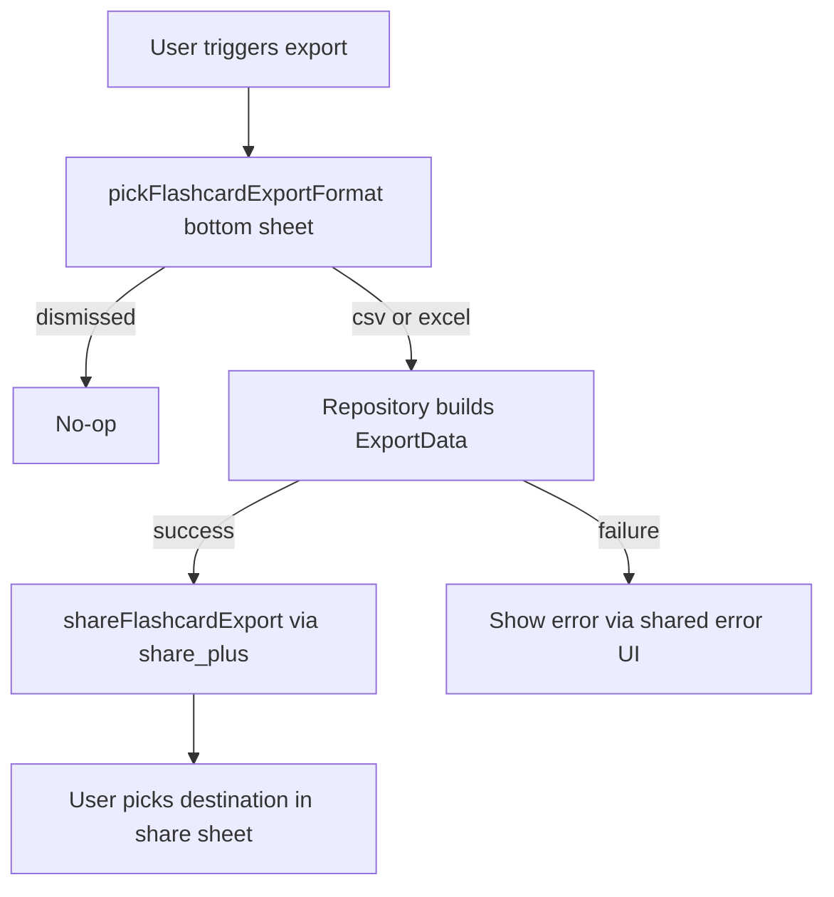

# Export

> **Status: Specified — nothing implemented (verified 2026-06-10).** No export use case,
> repository method, writer, or UI action exists in the current codebase; the file list below is
> the **target structure** from a previous iteration. The `share_plus` dependency is not in
> `pubspec.yaml` and requires approval before the FE slice.
>
> **Priority note (BA review 2026-06-10):** MemoX is local-first with NO working backup path —
> export CSV is currently the only cheap way for users to get their content out, and the data-loss
> guard until Drive sync lands. Deck-level CSV export (BE) is scheduled early in the WBS next-10
> (8.7.1) ahead of Drive sync. V1 cut: CSV only, deck scope only; Excel and selection-scope follow.

## Target source structure (none exist yet)

- `lib/domain/usecases/deck/export_deck_usecase.dart`
- `lib/data/repositories/` export writer + CSV escaping helpers
- `lib/presentation/features/flashcards/**` export trigger on deck actions sheet
- Share/save via `share_plus` (`XFile.fromData`) — dependency approval required

## Scope

Two export entry points exist:

| Entry | Scope | Source repository |
| --- | --- | --- |
| Deck export | All flashcards in one deck | `DeckRepository.exportDeck` |
| Flashcard selection export | Selected flashcard IDs | `FlashcardRepository.exportFlashcards` |

Both produce the same file format. The difference is only the source scope and file name.

## Formats

| Format | MIME type | Extension |
| --- | --- | --- |
| `ExportFormat.csv` | `text/csv` | `.csv` |
| `ExportFormat.excel` | `application/vnd.openxmlformats-officedocument.spreadsheetml.sheet` | `.xlsx` |

User picks format via `pickFlashcardExportFormat(context)` bottom sheet (`MxBottomSheet` with `MxActionSheetList`).

## Exported columns

Both formats export exactly three columns in this order:

| Column | Source | Empty handling |
| --- | --- | --- |
| `front` | Flashcard front | Always present (required field) |
| `back` | Flashcard back | Always present (required field) |
| `note` | Flashcard note | Empty string when null |

Row 1 is the header row.

NOT exported:

- `example`, `pronunciation`, `hint` (additional flashcard fields)
- Tags
- SRS progress (`current_box`, `due_at`, etc.)
- Deck/folder metadata
- Timestamps

This intentionally produces a portable, study-content-only file. Round-tripping (export then import) preserves only front/back/note.

## File naming

| Entry | Base name | Final name |
| --- | --- | --- |
| Deck export | `sanitizeFileName(deck.name)` | `{sanitized_deck_name}.csv` or `.xlsx` |
| Flashcard selection export | `'flashcards_export'` (literal) | `flashcards_export.csv` or `.xlsx` |

`sanitizeFileName` (in `repository_support.dart`) removes characters unsafe for filesystem paths and shells. Inspect that helper before changing the rule.

## CSV format details

- Encoding: UTF-8 (bytes via `utf8.encode`).
- Line separator: `\n` (Unix line ending).
- Header row: `front,back,note`.
- Cells escaped via `escapeCsvCell` (inspect `repository_support.dart`).
- No BOM.

Standard CSV escaping applies (quote cells containing comma, newline, or quote; double inner quotes).

## Excel (.xlsx) format details

- Minimal valid Office Open XML workbook (zip of XML parts).
- Built with `archive` + `xml` packages (no extra dependency beyond what import already uses).
- Single sheet named `'Flashcards'`.
- All cells use inline string type (`t="inlineStr"`) — no `sharedStrings.xml`, no styling.
- Verified to open in Excel and LibreOffice.

This is intentionally minimal. Do not add styling, formulas, or multi-sheet output without justification.

## Output delivery

Export does NOT write to a fixed path. Instead:

1. Repository returns `Result<ExportData>` containing `fileName`, `mimeType`, `bytes`.
2. Presentation layer calls `shareFlashcardExport(export)` which uses `share_plus` `XFile.fromData`.
3. Platform share sheet appears. User picks destination (save to Drive, send via Messages, save to Files, etc.).

Rationale: lets the user choose destination per export, no permission to write to user file system, works uniformly across iOS/Android/desktop/web.

## Rules

- Export source MUST be a non-empty card list. Empty deck export still produces a file with header only (no failure), but UI may skip the share step. Inspect viewmodel for current behavior.
- Export does NOT mutate any data. Read-only operation.
- Format conversion lives in `FlashcardExportWriter` static methods (`buildCsv`, `buildExcel`). Do not duplicate.
- Repository builds rows from entities; writer is entity-agnostic (`FlashcardExportRow`).
- MIME type comes from `FlashcardExportWriter.csvMimeType` / `excelMimeType` constants. Do not hardcode at call sites.
- File extension MUST match format (`.csv` for csv, `.xlsx` for excel).

## UI behavior

Trigger surfaces:

- Deck quick actions: long-press or actions menu on a deck → "Export deck".
- Flashcard list selection: select N cards → bulk action → "Export selected".

Flow:

## Required UI states

- Picker dismissed: no-op (no error).
- Build in progress: show loading indicator on trigger (deck quick action button or bulk action bar).
- Build failure: show shared error feedback.
- Share invocation failure: log and surface message (rare; share_plus handles most cases).

## Performance

- Build is synchronous in-memory operation. Acceptable for typical decks (≤ 10,000 cards).
- For very large decks: consider streaming write, but not required at current scale.
- CSV build is faster than Excel; Excel involves XML serialization and zip encoding.

## Agent rule

- Do not add new export columns (example/pronunciation/hint/tags/SRS) without updating this doc, both export use cases, both repository impls, the writer, and tests.
- Do not write export files to disk directly. Always go through share sheet via `shareFlashcardExport`.
- Do not introduce a new export format (JSON, Anki .apkg, etc.) without updating `ExportFormat` enum, picker, writer, and this doc.
- File name MUST come from `sanitizeFileName` for deck export and the literal `'flashcards_export'` for selection export. Do not let user-provided names skip sanitization.

## Related

**Wireframes:**

- `docs/wireframes/06-flashcard-list.md` — Export action in deck overflow ⋮
- `docs/wireframes/25-shared-bottom-sheets.md` §item-context (deck variant adds Export action)

**Schema:**

- `docs/database/schema-contract.md` → exports read from `flashcards` (front, back, note only — per simple scope decision); SRS progress not exported

**Decision table:**

- `docs/decision-tables/memox-core-decision-table.md` rows under "Export" (format support, field set, encoding)

**Glossary terms:**

- `docs/business/glossary.md` → "export", "CSV", "Excel/XLSX"

**Related business specs:**

- `docs/business/flashcard/flashcard-management.md` — fields that travel
- `docs/business/deck/deck-management.md` — deck is the export unit
- `docs/business/account-sync/account-sync.md` — full backup via Drive sync (the "backup" path; export is the "share" path)

**Source files to inspect:**

- `lib/data/repositories/flashcard_export_*.dart`
- `lib/domain/usecases/export/**`
