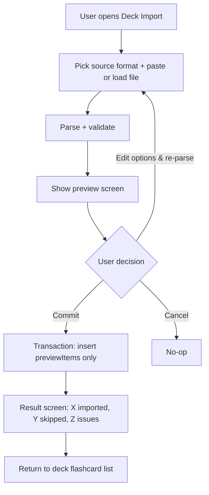

# Flashcard Management

## Source files to inspect

- `lib/presentation/features/flashcards/**`
- `lib/domain/**flashcard**`
- `lib/data/**flashcard**`
- `lib/data/datasources/local/tables/flashcards_table.dart`
- `lib/data/datasources/local/drift/flashcard_tags.drift`
- `lib/data/datasources/local/tables/flashcard_progress_table.dart`

## Data

Flashcards are stored in `flashcards`.

Supported fields are defined by current Drift schema. Agents must inspect schema before changing
forms or import logic.

Current V1 manual create/edit writes the schema-backed content fields that the editor surface
exposes today:

- `deck_id`
- `front`
- `back`
- `example_sentence`
- `pronunciation`
- `hint`
- `tags` (stored separately via `flashcard_tags`)
- `sort_order`

Tags are stored separately in `flashcard_tags` and are part of the current flashcard create screen.
Edit surface tag editing remains future work until the edit route is promoted.

SRS state is stored in `flashcard_progress`. See `docs/business/srs/srs-review.md`.

## Rules

- Flashcard belongs to exactly one deck.
- Front is required after trim.
- Back is required after trim.
- Optional example / pronunciation / hint text should be trimmed.
- Empty optional example / pronunciation / hint text is stored as `null`, not an empty string.
- Tags are trimmed, lowercased on save, and deduplicated case-insensitively per flashcard.
- Tags must be non-empty after trim.
- Tags are deduplicated case-insensitively per flashcard.
- Flashcard must not be edited under wrong deck.
- Delete removes related local data according to persistence rules.

## Import rules

- Target deck must exist.
- Imported rows must pass same validation as manual creation.
- Invalid rows must be reported clearly via the preview screen (see "Import preview flow" below).
- Do not silently create garbage rows.
- Import result distinguishes success (committed previewItems), skipped duplicates, and validation
  issues.
- Import must use a transaction (see `docs/database/storage-boundaries.md`).

## Import sources

| Source                              | When                              | Notes                                                                                     |
|-------------------------------------|-----------------------------------|-------------------------------------------------------------------------------------------|
| `ImportSourceFormat.csv`            | Pasted text or loaded `.csv` file | Standard CSV (UTF-8).                                                                     |
| `ImportSourceFormat.excel`          | Loaded `.xlsx` file               | First sheet read. `excelHasHeader` toggle decides if row 1 is skipped.                    |
| `ImportSourceFormat.structuredText` | Pasted text with custom separator | Separator chosen by user (`auto`, `tab`, `comma`, `colon`, `slash`, `semicolon`, `pipe`). |

`structuredText` with `auto` infers separator by frequency analysis of the first non-empty line.

## Duplicate policy

`FlashcardImportDuplicatePolicy.skipExactDuplicates` is the only policy supported.

Duplicate detection:

- An imported row is a duplicate of another imported row if `front` and `back` match after trim and
  case-insensitive comparison.
- An imported row is a duplicate of an existing card if `front` and `back` match the same way
  against any card in the target deck.

Skipped duplicates appear in `FlashcardImportPreparation.skippedDuplicates` with their source:

| `FlashcardImportDuplicateSource` | Meaning                                                                 |
|----------------------------------|-------------------------------------------------------------------------|
| `importFile`                     | Duplicate WITHIN the imported file (only the first occurrence is kept). |
| `deck`                           | Duplicate against an EXISTING card in the target deck.                  |

## Import preview flow

Every import opens a preview screen before any database write. No silent commits.

### Preview screen content

| Section            | Content                                                                                     | Visibility                                                                                                                                                                                                |
|--------------------|---------------------------------------------------------------------------------------------|-----------------------------------------------------------------------------------------------------------------------------------------------------------------------------------------------------------|
| Summary            | "Will import: N cards. Skipped: M duplicates. Issues: K."                                   | Always                                                                                                                                                                                                    |
| Valid rows list    | First 50 rows of `previewItems` with `front` / `back` / `note` columns. "Show all" if more. | Always                                                                                                                                                                                                    |
| Skipped duplicates | Each `FlashcardImportSkippedDuplicate` with badge ("In file" / "In deck")                   | When `skippedDuplicates.isNotEmpty` — **Future**: V1 surfaces an aggregate "N duplicates skipped" count badge only, not a per-row list (see `docs/wireframes/10-deck-import.md` §V1 verification status). |
| Validation issues  | Each `ImportValidationIssue` with `lineNumber` + `message`                                  | When `issues.isNotEmpty`                                                                                                                                                                                  |
| Commit CTA         | Primary button "Import N cards"                                                             | Enabled only when `canCommit == true`                                                                                                                                                                     |
| Cancel CTA         | Secondary button                                                                            | Always                                                                                                                                                                                                    |

### Validation issues

Triggered by:

- Empty `front` after trim → "Line {n}: front is required."
- Empty `back` after trim → "Line {n}: back is required."
- Front length exceeds field max → "Line {n}: front exceeds {N} chars."
- Back length exceeds field max → "Line {n}: back exceeds {N} chars."
- Tag invalid (empty after trim, or exceeds max length) → "Line {n}: invalid tag '{tag}'."
- Excel/CSV format error (e.g., unparseable column count) → "Line {n}: row has {x} columns, expected
  {y}."

A preparation with any issue cannot be committed (`canCommit = false`). User MUST either:

- Edit the source (paste/file) and re-parse, OR
- Cancel.

### Inline edit during preview

NOT supported. Rationale:

- Inline edit complicates duplicate detection and validation re-runs.
- Users editing a single row would need to re-parse the whole file anyway.
- Force users back to source keeps the model simple.

If the user finds a wrong row, they must fix the source (paste box content or file content) and
re-import. Document this clearly in UI ("Edit your file and re-paste / re-load to fix issues").

### Commit behavior

On commit:

1. Open transaction.
2. Compute next `sort_order` (current max + 1).
3. Insert each `FlashcardImportPreviewItem.draft` as a new flashcard in target deck, with default
   SRS progress (box=1, due=now).
4. Apply tags from each draft.
5. Set `created_at`, `updated_at` to now.
6. Commit transaction.

If transaction fails: surface failure feedback, retain preview state so user can retry.

### Result screen

> **Future (not in V1).** The standalone result screen below is the target. V1 does not render a
> separate result step: on a successful commit the screen shows a deferred success snackbar (
`importSuccessMessage(count)`) and pops back to the Flashcard List. The committed/skipped counts are
> computed in `FlashcardImportPreparation` but only the imported count is surfaced (via the snackbar).
> See `docs/wireframes/10-deck-import.md` §V1 verification status.

After commit:

| Field              | Value                                               |
|--------------------|-----------------------------------------------------|
| Imported           | `previewItems.length` (number actually committed)   |
| Skipped duplicates | `skippedDuplicates.length` with breakdown by source |
| Issues             | (should be 0 since canCommit required this)         |
| CTA                | "Done" → back to flashcard list                     |

Optional secondary CTA: "Import more" → reset import flow.

## Cross-account import

- Import operates on the active account's database (see
  `docs/business/account-sync/account-sync.md`).
- File source is platform-neutral (the file picker reads any file the user has access to).
- The file does NOT carry account identity. A CSV/Excel exported from account A imports cleanly into
  account B.
- The user is responsible for content separation. App makes no provider-bound restriction.
- Drive sync metadata is not part of import scope; only flashcard content is imported.

## Screen behavior

Flashcard list/editor/import should support:

- Loading state.
- Empty state.
- Error state.
- Saving state.
- Validation message.
- Delete confirmation.
- Safe return to deck flashcard list.

V1 create/edit note:

- Flashcard create and edit routes share `FlashcardEditorScreen`.
- Create mode is selected by `deckId` with no `flashcardId`; edit mode is selected by `deckId` +
  `flashcardId`.
- The editor owns content create and update only.
- Current create mode saves front, back, optional example / pronunciation / hint text, and tags.
  Destination-deck retargeting and save-and-add-another remain future work.
- Create/edit dirty close and browser/system back require a discard confirmation when unsaved
  content exists.
- Single-card move/delete/export actions live on the flashcard list row/bulk action surfaces.
- Bury/Suspend live on the study-session card-actions sheet.
- Flashcard History is Future Proposal and must not be exposed as a live editor/list action in V1.
- Learned front/back edits keep SRS progress unless the explicit progress-policy dialog chooses
  Reset.

Deck import screen (`/library/deck/:deckId/import`):

- Format picker (CSV / Excel / Structured text).
- Format-specific options:
    - Excel: `excelHasHeader` toggle.
    - Structured text: separator picker.
- Source area: paste box (for csv/text) OR "Load file" button (for excel/file).
- "Preview" action runs parse + validation.
- Below: preview screen content (see above).

## Form rules

- Save button disabled until required fields valid.
- Save action shows saving state, disables form.
- Save success returns to list with refreshed data.
- Dirty form requires confirm on close/back, including browser/system back when supported by
  Flutter.

## Performance

- Flashcard list >100 items: pagination or sliver-based virtualization.
- Tag input in the editor: debounce 200ms.
- Search: debounce 300ms.
- Large deck flashcard list initial load: stream first 50, lazy load rest.

## Agent rule

Do not add new flashcard fields without updating schema, mapper, docs, l10n, tests, and generated
files.

## Related

**Wireframes:**

- `docs/wireframes/06-flashcard-list.md` — list, filter, selection mode, bulk bar
- `docs/wireframes/07-flashcard-create.md` — create flow + save-and-add-another
- `docs/wireframes/08-flashcard-edit.md` — edit + card actions
- `docs/wireframes/09-flashcard-history.md` — per-card timeline
- `docs/wireframes/10-deck-import.md` — preview-only import flow
- `docs/wireframes/24-shared-dialogs.md` §delete-confirm, §discard-changes
- `docs/wireframes/25-shared-bottom-sheets.md` §card-context, §tag-picker

**Schema:**

- `docs/database/schema-contract.md` → `flashcards` (
  front/back/note/example/pronunciation/hint/deck_id), `flashcard_progress` (current_box, due_at,
  buried_until, is_suspended, last_reset_at), `flashcard_tags`

**Decision table:**

- `docs/decision-tables/memox-core-decision-table.md` rows under "Flashcard management", "Import", "
  Validation"

**Glossary terms:**

- `docs/business/glossary.md` → flashcard, front, back, example

**Related business specs:**

- `docs/business/deck/deck-management.md` — flashcards belong to decks
- `docs/business/tags/tag-system.md` — tag validation rules apply on create/edit
- `docs/business/srs/srs-review.md` — flashcard_progress drives SRS
- `docs/business/bulk/bulk-operations.md` — multi-card operations
- `docs/business/history/card-history.md` — view-only timeline of attempts
- `docs/business/study-actions/bury-suspend.md` — bury/suspend acts on flashcard_progress
- `docs/business/navigation/navigation-flow.md` — flashcard CRUD routes

**Source files to inspect:**

- `lib/data/datasources/local/tables/flashcards_table.dart`
- `lib/data/datasources/local/tables/flashcard_progress_table.dart`
- `lib/data/datasources/local/drift/flashcard_tags.drift`
- `lib/data/repositories/flashcard_import_*.dart`
- `lib/domain/entities/flashcard.dart`
- `lib/domain/usecases/flashcard/**`
- `lib/presentation/features/flashcard/**`
