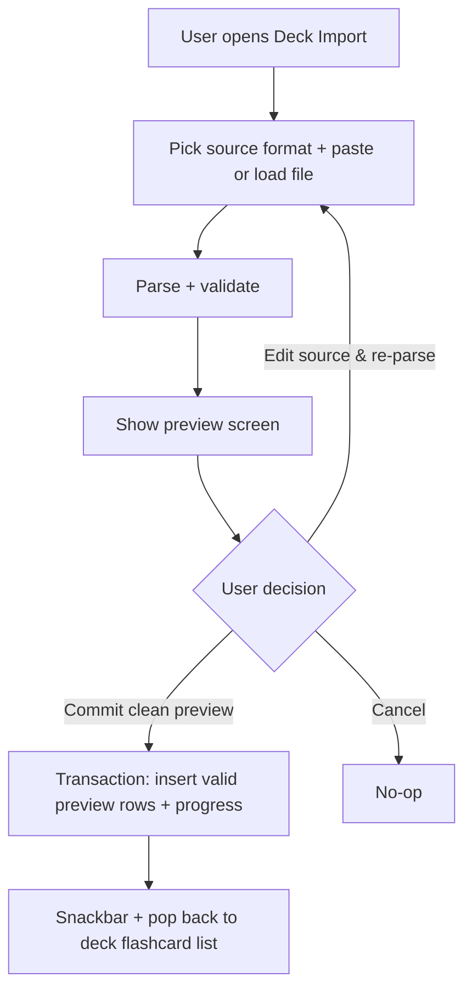

# Flashcard Management

## Source files to inspect

- `lib/presentation/features/flashcards/**`
- `lib/domain/**flashcard**`
- `lib/data/**flashcard**`
- `lib/data/datasources/local/drift/` (flashcards + flashcard_progress tables)
- `lib/data/datasources/local/drift/flashcard_tags.drift`

## Data

Flashcards are stored in `flashcards`.

Supported fields are defined by current Drift schema. Agents must inspect schema before changing
forms or import logic.

Current V1 manual create/edit writes the schema-backed content fields that the editor surface
exposes today:

- `deck_id`
- `front`
- `back`
- `example_sentence`
- `pronunciation`
- `hint`
- `tags` (stored separately via `flashcard_tags`)
- `sort_order`

Tags are stored separately in `flashcard_tags` and are part of the current flashcard create/edit
screen.

SRS state is stored in `flashcard_progress`. See `docs/business/srs/srs-review.md`.

## Rules

- Flashcard belongs to exactly one deck.
- Front is required after trim.
- Back is required after trim.
- Optional example / pronunciation / hint text should be trimmed.
- Empty optional example / pronunciation / hint text is stored as `null`, not an empty string.
- Tags are trimmed, lowercased on save, and deduplicated case-insensitively per flashcard.
- Tags must be non-empty after trim.
- Tags are deduplicated case-insensitively per flashcard.
- Flashcard must not be edited under wrong deck.
- **Manual-create duplicate soft-warning (Implemented BE, WBS 2.20.1):** when saving a card whose
  trimmed, case-insensitive `front`+`back` matches an existing card in the same deck, surface a
  non-blocking warning result for the editor flow. Do NOT hard reject; create/update still save the
  card. Rationale: import already detects duplicates; manual create silently allowing them is
  inconsistent.
- Delete removes related local data according to persistence rules.

## Import rules

- Target deck must exist.
- Current V1 deck import (kit screen 10, WBS 6.1.1/6.3.1) is a **file-picker wizard**:
  `DeckImportScreen` lets the user pick a **CSV/TSV file** (`file_picker`), auto-detects the
  separator, shows a preview (valid rows + parse issues + duplicates, with a found/valid/skip
  summary), and commits the valid subset transactionally — surfacing an inline success / partial /
  failed result. (`parse_deck_import_csv_usecase.dart`, `prepare_deck_import_usecase.dart`,
  `commit_deck_import_usecase.dart`.) **Mock-authoritative:** the file-picker flow superseded the
  pre-redesign paste-CSV + separator-dropdown design. **Anki `.apkg` and Excel remain Future**
  (the parser reads `csv`/`tsv`/`txt` only); a live "N of M" import-progress counter is Future
  (atomic commit, no progress stream).
- Imported rows must pass the same front/back validation as manual creation.
- Invalid rows must be reported clearly via the preview screen (see "Import preview flow" below).
- Do not silently create garbage rows.
- Duplicate detection, skipped-duplicate reporting, and transaction commit are implemented in the
  backend pipeline (commit `44407390` + bypass guard `e84f5115`). CSV V1 does not parse tags.

### Import data model (pinned contract — WBS 6.0.1)

The import vocabulary is pinned ahead of the parse/commit logic so every import row shares one
contract (`lib/domain/types/**` + `lib/domain/models/flashcard_import_preview.dart`; full table in
`docs/contracts/usecase-contracts/flashcard.md` §Import preview model family,
`docs/contracts/types-catalog.md`). Two stages:

- **Parse + validate** → `FlashcardImportPreview` `{ rows, issues }`. Each problem is an
  `ImportValidationIssue` (`ImportRowIssueType` + `lineNumber` + `message`). Commit is gated on a
  clean preview (`canCommit`).
- **Prepare (dedup)** → `FlashcardImportPreparation` `{ previewItems, skippedDuplicates }` after
  `FlashcardImportDuplicatePolicy.skipExactDuplicates`; each `skippedDuplicates` entry carries its
  `FlashcardImportDuplicateSource`. `previewItems` are what the commit transaction inserts.

Source format is `ImportSourceFormat` (`structuredText` splits on `ImportTextSeparator`). The parse,
dedup, and commit logic land in WBS 6.2.x–6.9.1.

## Import sources

| Source                              | When                              | Notes                                                                                     |
|-------------------------------------|-----------------------------------|-------------------------------------------------------------------------------------------|
| `ImportSourceFormat.csv`            | File picker (CSV/TSV file)         | Current V1 (kit screen 10): pick a CSV/TSV file → auto-separator parse + validation + duplicate preview → commit valid rows. Optional columns are ignored. |
| `ImportSourceFormat.excel`          | Future                            | Deferred. First sheet read. `excelHasHeader` toggle decides if row 1 is skipped.         |
| `ImportSourceFormat.structuredText` | Backend-supported, UI deferred     | Separator supported: `auto`, `tab`, `comma`, `colon`, `slash`, `semicolon`, `pipe`.      |

`structuredText` with `auto` infers separator by frequency analysis of the first non-empty line;
ties are treated as invalid input.

## Duplicate policy

`FlashcardImportDuplicatePolicy.skipExactDuplicates` is the only policy supported (implemented in
the backend pipeline; preview-surface UI for duplicates remains deferred).

Duplicate detection:

- An imported row is a duplicate of another imported row if `front` and `back` match after trim and
  case-insensitive comparison.
- An imported row is a duplicate of an existing card if `front` and `back` match the same way
  against any card in the target deck.

Skipped duplicates appear in `FlashcardImportPreparation.skippedDuplicates` with their source:

| `FlashcardImportDuplicateSource` | Meaning                                                                 |
|----------------------------------|-------------------------------------------------------------------------|
| `importFile`                     | Duplicate WITHIN the imported file (only the first occurrence is kept). |
| `deck`                           | Duplicate against an EXISTING card in the target deck.                  |

## Import preview flow

Current V1 deck import keeps CSV preview on the same screen and commits valid rows transactionally.
Structured text uses the same backend parse/validate/commit pipeline (UI entry deferred).

### Preview screen content

| Section            | Content                                                                                     | Visibility                                                                                                                                                                                                |
|--------------------|---------------------------------------------------------------------------------------------|-----------------------------------------------------------------------------------------------------------------------------------------------------------------------------------------------------------|
| Summary            | "Will import: N cards. Issues: K."                                                          | Always                                                                                                                                                                                                    |
| Valid rows list    | CSV rows with `front` / `back` columns only.                                               | When at least one valid row exists                                                                                                                                                                         |
| Validation issues  | Each `ImportValidationIssue` with `lineNumber` + `message`                                  | When `issues.isNotEmpty`                                                                                                                                                                                  |
| Ready callout      | `importPreviewCommitReadyMessage`                                                           | When preview has at least one valid row and no validation issues                                                                                                                                            |
| Commit CTA         | Transactional commit button                                                                  | Enabled only when preview has at least one valid row and no validation issues                                                                                                                             |
| Cancel CTA         | Secondary button                                                                            | Future                                                                                                                                                                                                    |

### Validation issues

Triggered by:

- Empty `front` after trim → "Line {n}: front is required." (`missingFront`, WBS 6.2.2)
- Empty `back` after trim → "Line {n}: back is required." (`missingBack`, WBS 6.2.2)
- Front length exceeds field max → "Line {n}: front exceeds {N} chars." (Future — no front/back field
  maximum is defined or enforced anywhere in V1, including manual create; `frontTooLong` stays
  reserved until a limit is introduced.)
- Back length exceeds field max → "Line {n}: back exceeds {N} chars." (Future — see above;
  `backTooLong` reserved.)
- Tag invalid (empty after trim, or exceeds max length) → "Line {n}: invalid tag '{tag}'."
- CSV format error (e.g., unparseable column count) → "Line {n}: row has {x} columns, expected
  {y}."

In V1 the preview is read-only. The user MUST either:

- Edit the source (paste/file) and re-parse, OR
- Cancel.

### Inline edit during preview

NOT supported. Rationale:

- Inline edit complicates duplicate detection and validation re-runs.
- Users editing a single row would need to re-parse the whole file anyway.
- Force users back to source keeps the model simple.

If the user finds a wrong row, they must fix the source (paste box content or file content) and
re-import. Document this clearly in UI ("Edit your file and re-paste / re-load to fix issues").

### Commit behavior

On commit:

1. Open transaction.
2. Compute next `sort_order` (current max + 1).
3. Insert each valid preview row as a new flashcard in target deck.
4. Create default SRS progress for each inserted flashcard (`box=1`, `due_at=NULL` — brand-new,
   never scheduled, so the card counts as NEW until first studied).
5. Set `created_at`, `updated_at` to now.
6. Commit transaction.

If transaction fails: surface failure feedback, retain preview state so user can retry.
The failure snackbar uses `importFailedMessage`.

### Result screen

> **Current V1 (kit screen 10, WBS 6.5.1).** The wizard renders **inline terminal result states**
> (`DeckImportResultView`): **success** ("N cards imported" + Open deck / Done), **partial**
> ("N imported · M skipped" + Import another / Done), and **failed** ("Import failed" + Try again /
> Choose another file). The older "success snackbar + pop" plan is superseded by these inline cards.
> The imported count is the number of rows actually committed. A dedicated "Review skipped" list is
> Future (the partial primary is "Import another file").

After commit:

| Field              | Value                                               |
|--------------------|-----------------------------------------------------|
| Imported           | `previewItems.length` (number actually committed)   |
| Skipped duplicates | `skippedDuplicates.length` with breakdown by source |
| Issues             | (should be 0 since canCommit required this)         |
| CTA                | "Done" → back to flashcard list                     |

Optional secondary CTA: "Import more" → reset import flow.

## Cross-account import

- Import operates on the active account's database (see
  `docs/business/account-sync/account-sync.md`).
- File source is platform-neutral (the file picker reads any file the user has access to).
- The file does NOT carry account identity. A CSV/Excel exported from account A imports cleanly into
  account B.
- The user is responsible for content separation. App makes no provider-bound restriction.
- Drive sync metadata is not part of import scope; only flashcard content is imported.

## Screen behavior

Flashcard list/editor/import should support:

- Loading state.
- Empty state.
- Error state.
- Saving state.
- Validation message.
- Delete confirmation.
- Safe return to deck flashcard list.

V1 create/edit note:

- Flashcard create and edit routes share `FlashcardEditorScreen`.
- Create mode is selected by `deckId` with no `flashcardId`; edit mode is selected by `deckId` +
  `flashcardId`.
- The editor owns content create, update, and the explicit danger-zone delete action.
- Current create mode saves front, back, optional example / pronunciation / hint text, and tags.
  It also supports a local "save and add another" checkbox under Tags that saves the current
  card, clears the draft, and keeps the user in the same deck for batch entry. Destination-deck
  retargeting remains future work.
- Create/edit dirty close and browser/system back require a discard confirmation when unsaved
  content exists.
- Single-card move/export actions live on the flashcard list row/bulk action surfaces. The edit
  route also exposes a delete danger zone with confirmation, matching the current mock.
- Bury/Suspend live on the study-session card-actions sheet.
- Flashcard History is Future Proposal and must not be exposed as a live editor/list action in V1.
- Learned front/back edits keep SRS progress unless the explicit progress-policy dialog chooses
  Reset.

Deck import screen (`/library/deck/:deckId/import`):

 - Current V1 route opens the **file-picker wizard** (`DeckImportScreen`, top-level immersive):
   choose a CSV/TSV file → parse + duplicate preview → commit the valid subset, with inline
   success / partial / failed results.
 - States: empty (Choose file) → file-selected (chip + Parse file) → parsing → preview
   (all-valid / mixed, with found/valid/skip summary + per-row reasons + Skip badges) → importing →
   success / partial / failed.
 - **Anki `.apkg` and Excel are Future** (the picker accepts `csv`/`tsv`/`txt`); the separator is
   auto-detected (no separator picker).
 - Duplicate detection runs in the backend pipeline; duplicates are **shown in the preview** (red
   "Duplicate card" rows with a Skip badge) and excluded from the commit.

## Form rules

- Save button disabled until required fields valid.
- Save action shows saving state, disables form.
- Save success returns to list with refreshed data.
- Dirty form requires confirm on close/back, including browser/system back when supported by
  Flutter.

## Performance

- Flashcard list >100 items: pagination or sliver-based virtualization.
- Tag input in the editor: debounce 200ms.
- Search: debounce 300ms.
- Large deck flashcard list initial load: stream first 50, lazy load rest.

## Agent rule

Do not add new flashcard fields without updating schema, mapper, docs, l10n, tests, and generated
files.

## Related

**Wireframes:**

- `docs/wireframes/06-flashcard-list.md` — list, filter, selection mode, bulk bar
- `docs/wireframes/07-flashcard-create.md` — create flow + save-and-add-another
- `docs/wireframes/08-flashcard-edit.md` — edit + card actions
- `docs/wireframes/09-flashcard-history.md` — per-card timeline
- `docs/wireframes/10-deck-import.md` — CSV preview + commit import flow
- `docs/wireframes/24-shared-dialogs.md` §delete-confirm, §discard-changes
- `docs/wireframes/25-shared-bottom-sheets.md` §card-context, §tag-picker

**Schema:**

- `docs/database/schema-contract.md` → `flashcards` (
  front/back/note/example/pronunciation/hint/deck_id), `flashcard_progress` (current_box, due_at,
  buried_until, is_suspended, last_reset_at), `flashcard_tags`

**Decision table:**

- `docs/decision-tables/memox-core-decision-table.md` rows under "Flashcard management", "Import", "
  Validation"

**Glossary terms:**

- `docs/business/glossary.md` → flashcard, front, back, example

**Related business specs:**

- `docs/business/deck/deck-management.md` — flashcards belong to decks
- `docs/business/tags/tag-system.md` — tag validation rules apply on create/edit
- `docs/business/srs/srs-review.md` — flashcard_progress drives SRS
- `docs/business/bulk/bulk-operations.md` — multi-card operations
- `docs/business/history/card-history.md` — view-only timeline of attempts
- `docs/business/study-actions/bury-suspend.md` — bury/suspend acts on flashcard_progress
- `docs/business/navigation/navigation-flow.md` — flashcard CRUD routes

**Source files to inspect:**

- `lib/data/datasources/local/drift/` (flashcards + flashcard_progress tables)
- `lib/data/datasources/local/drift/flashcard_tags.drift`
- `lib/domain/usecases/flashcard/check_manual_duplicate_flashcard_usecase.dart`
- `lib/domain/models/flashcard_duplicate_check_result.dart`
- `test/domain/usecases/flashcard/check_manual_duplicate_flashcard_usecase_test.dart`
- `lib/domain/usecases/flashcard/parse_deck_import_csv_usecase.dart`,
  `prepare_deck_import_usecase.dart`, `commit_deck_import_usecase.dart` (import pipeline)
- `lib/data/repositories/flashcard_repository_impl.dart` (`loadDeckCardContents` import read)
- `lib/domain/usecases/flashcard/parse_deck_import_csv_usecase.dart`, `lib/domain/usecases/flashcard/prepare_deck_import_usecase.dart`
- `lib/core/util/csv_tokenizer.dart`
- `lib/domain/entities/flashcard.dart`
- `lib/domain/usecases/flashcard/**`
- `lib/presentation/features/flashcards/**`
