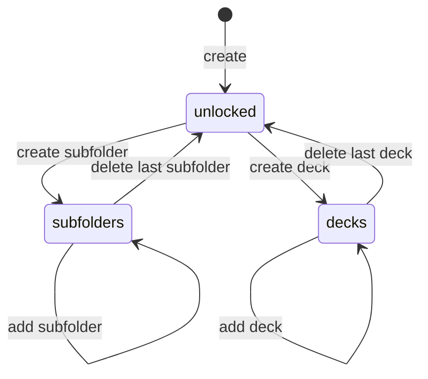

# Folder Management

## Source files to inspect

- `lib/presentation/features/folders/**`
- `lib/domain/**folder**`
- `lib/data/**folder**`
- `lib/data/datasources/local/tables/folders_table.dart`

## Data

Folders are stored in `folders`.

Important fields:

- `id`
- `parent_id`
- `name`
- `content_mode`
- `sort_order`
- `created_at`
- `updated_at`

## Content mode

See `docs/business/glossary.md` for definitions.

| Mode | Meaning | Allowed children |
| --- | --- | --- |
| `unlocked` | Empty or not locked | Subfolder or deck |
| `subfolders` | Locked to subfolders | Only subfolders |
| `decks` | Locked to decks | Only decks |

## Content mode transitions

## Rules

- Folder can contain either subfolders or decks, not both.
- Root folder has `parent_id = null`.
- Child folder must have valid parent.
- Folder name is required after trim.
- Folder name max length follows schema constraint (inspect table).
- Creating subfolder locks parent to `subfolders`.
- Creating deck locks parent to `decks`.
- Folder with `subfolders` cannot create deck.
- Folder with `decks` cannot create subfolder.
- Lock-mode rejection is typed: deck-locked parents use `folder_contains_decks`, subfolder-locked parents use `folder_contains_subfolders`. Folder Detail maps these to localized snackbar copy and must not show the generic unexpected-error message for this case.
- Moving folder must not create cycle.
- Deleting last child returns folder to `unlocked`.
- Deleting folder deletes nested content according to persistence rules.

## Screen behavior

Folder list/detail should support:

- Loading state (`MxLoadingState`).
- Empty state (`MxEmptyState`).
- Error state (`MxErrorState`).
- Search/sort when supported.
- Manual reorder only when current sort mode allows it.
- Create subfolder/deck actions according to content mode.
- Safe delete confirmation.

## Performance

- Folder list >50 items: use `ListView.builder`.
- Search input: debounce 300ms.
- Subfolder count badge: stream from database, not computed in widget.

## Agent rule

Do not enforce folder content mode only in UI. The rule must be protected by use case/domain/data flow.

## Related

**Wireframes:**

- `docs/wireframes/02-library.md` — Library root showing top-level folders
- `docs/wireframes/05-folder-detail.md` — folder detail (subfolders / decks / unlocked modes)
- `docs/wireframes/24-shared-dialogs.md` §folder-create, §rename, §delete-confirm
- `docs/wireframes/25-shared-bottom-sheets.md` §folder-picker, §item-context

**Schema:**

- `docs/database/schema-contract.md` → `folders` table (`id`, `parent_id`, `name`, `content_mode`, `sort_order`, timestamps)

**Decision table:**

- `docs/decision-tables/memox-core-decision-table.md` rows under "Folder management" (folder mode lock, move cycle prevention, delete cascade)

**Glossary terms:**

- `docs/business/glossary.md` → `content_mode`, `unlocked`, `subfolders`, `decks` modes; folder hierarchy

**Related business specs:**

- `docs/business/deck/deck-management.md` — decks live inside folders, share parent rules
- `docs/business/navigation/navigation-flow.md` — `/library/folder/:id` route contract
- `docs/business/bulk/bulk-operations.md` — folder is one of the bulk-move destinations

**Source files to inspect:**

- `lib/data/datasources/local/tables/folders_table.dart`
- `lib/domain/entities/folder.dart`
- `lib/domain/repositories/folder_repository.dart`
- `lib/domain/usecases/folder/**`
- `lib/presentation/features/library/**` (folder views)
