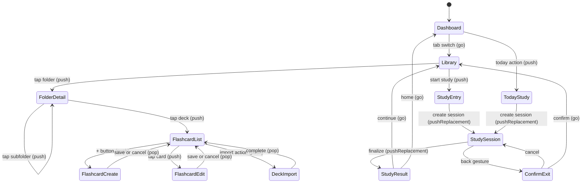

# Navigation Flow

## Source files to inspect

- `lib/app/router/app_router.dart`
- `lib/app/router/route_names.dart`
- `lib/presentation/features/**/routes/*.dart`
- `lib/app/app_shell.dart`

## Router contract

- Use GoRouter.
- Use existing `RouteNames` and `RoutePaths`.
- Do not hardcode route strings in widgets.
- Add route constants before adding new routes.
- Keep shell navigation visibility correct.

## Top-level destinations

| Path        | Responsibility | Shell visible |
|-------------|----------------|---------------|
| `/home`     | Dashboard      | Yes           |
| `/library`  | Library        | Yes           |
| `/progress` | Progress       | Yes           |
| `/settings` | Settings hub   | Yes           |

Current V1 app boot redirects `/` to `RouteDefaults.initialLocation = RoutePaths.library`. This is
the existing app entry and must not be replaced by an onboarding wizard in V1. Dashboard remains a
top-level destination, but changing the default entry to `/home` requires a dedicated navigation
task with route tests and doc updates.

## Settings routes

| Path                      | Responsibility                                                                                                             | Shell visible |
|---------------------------|----------------------------------------------------------------------------------------------------------------------------|---------------|
| `/settings/account`       | Account linking + Drive sync                                                                                               | No            |
| `/settings/learning`      | Learning settings (daily goal, reminder, tags, future study defaults)                                                     | No            |
| `/settings/learning/tags` | Tag management (new; see `docs/business/tags/tag-system.md` and wireframe `docs/wireframes/22-settings-tag-management.md`) | No            |
| `/settings/audio-speech`  | Audio & speech settings (Korean / English tabs, voice list, sliders, preview)                                             | No            |

Route name constants (from `lib/app/router/route_names.dart`): `RouteNames.settings`,
`RouteNames.settingsAccount`, `RouteNames.settingsLearning`, `RouteNames.settingsLearningTags`,
`RouteNames.settingsAudioSpeech`. Path segment constants: `RoutePaths.settingsAccountSegment`,
`RoutePaths.settingsLearningSegment`, `RoutePaths.settingsLearningTagsSegment`,
`RoutePaths.settingsAudioSpeechSegment`.

## Library routes

| Route responsibility      | Route pattern                                                                                                                                                                                                                                                                           | Shell visible |
|---------------------------|-----------------------------------------------------------------------------------------------------------------------------------------------------------------------------------------------------------------------------------------------------------------------------------------|---------------|
| Folder detail             | `/library/folder/:id`                                                                                                                                                                                                                                                                   | Yes           |
| Flashcard list            | `/library/deck/:deckId/flashcards`                                                                                                                                                                                                                                                      | Yes           |
| Flashcard list (filtered) | `/library/deck/:deckId/flashcards?filter={active\|suspended\|buried\|due}&tag={t1,t2}`                                                                                                                                                                                                  | Yes           |
| Flashcard create          | `/library/deck/:deckId/flashcards/new`                                                                                                                                                                                                                                                  | No            |
| Flashcard edit            | `/library/deck/:deckId/flashcards/:flashcardId/edit`                                                                                                                                                                                                                                    | No            |
| Flashcard history         | `/library/deck/:deckId/flashcards/:flashcardId/history` (Current V1 — opens `CardHistoryScreen` from a card's row action; read-only attempt timeline + reset progress)                                                                                                                    | No            |
| Deck import               | `/library/deck/:deckId/import`                                                                                                                                                                                                                                                          | No            |
| Library search            | `/library/search` (Current — global search over folders/decks/flashcards; tags section + recent/popular are Future). Exposed as a separate route, not from the Library Overview app bar                                                                                                  | Yes           |
| Study entry               | `/library/study/:entryType/:entryRefId` (Current entryType: `deck` \| `folder`; `tag` is Blocked/Future). Current V1 opens `StudyEntryScreen`, validates params, resolves the scope, renders empty states for zero eligible cards, and `pushReplacement`s to `/library/study/session/:sessionId` when eligible cards exist. Optional `?study_type=srs_review` requests a deck-scoped or folder-scoped due review (Current — parsed by the gate; the deck/folder screen CTAs that would link here are Future); optional `?mode=` selects a single study mode | No            |
| Today study               | `/library/study/today` (Current V1 opens `StudyEntryScreen.today` and follows the same gate behavior as scoped study, including empty states and session redirect)                                                                                                                                                                                                    | No            |
| Study session             | `/library/study/session/:sessionId` (Current V1 review screen; `?mode=review` opens the swipe-grade review surface, the no-mode fallback keeps the recall shell, protected exit confirmation applies, Finish Session appears only after every card is answered, and `pushReplacement`s to the real result screen on explicit finish)                                                                                                                                                          | No            |
| Study result              | `/library/study/session/:sessionId/result` (Current V1 result screen; opens `StudyResultScreen` with a localized completion summary for completed/finalized sessions and controlled fallback states for invalid/missing and incomplete sessions)                                                                                                                                                              | No            |

Notes:

- Query-string filters on the flashcard list are application conventions; verify GoRouter
  declarations in `lib/presentation/features/**/routes/*.dart`.
- The `tag` entry type is Blocked/Future until `StudyEntryType.tag` and tag-scope queries are
  promoted.
- Flashcard history is Current: `RouteNames.flashcardHistory` /
  `RoutePaths.flashcardHistoryTemplate`
  (`/library/deck/:deckId/flashcards/:flashcardId/history`), pushed over the shell from the
  root navigator (shell hidden), entered via the flashcard row-action sheet ("View history").
- Library search is Current: `RouteNames.librarySearch` / `RoutePaths.librarySearchTemplate`
  (`/library/search`), registered as a child of the Library branch (shell visible). The promoted V1
  scope covers folders/decks/flashcards only; the Library Overview screen no longer exposes a search
  affordance in the app bar. The tags result section, recent searches, and popular-tags landing
  remain Future Proposal pending the tag subsystem + a `shared_preferences` dependency
  (`docs/business/search/global-search.md`).
- Folder Detail study entry points (Study folder / Today / Resume banner) are **Future — not
  built** (`folder_detail_screen.dart` documents the study layer as Future). Target behavior when
  built: Study folder and Today route through the Study Entry gate (`entry_type=folder`, with
  `study_type=srs_review` for Today); the Resume banner opens the existing `study/session/:id`
  directly without re-entering the gate or creating a session. Folder Detail never creates a
  session itself.
- Flashcard List study entry points (Study deck / Today / Resume banner) are **Future — not
  built**. Target behavior when built: Study deck and Today route through the Study Entry gate
  (`entry_type=deck`, with `study_type=srs_review` for Today — never global `entry_type=today`);
  the Resume banner opens the existing `study/session/:id` directly without re-entering the gate
  or creating a session. Flashcard List never creates a session itself.
- The `?study_type=srs_review` query parameter itself IS Current — the gate parses and honors it
  (`lib/domain/study/study_entry_parser.dart`); only the in-screen CTA surfaces above are Future.
- Study Session is a real review screen in V1: it loads a persisted session and ordered session
  items, shows the current card with a reveal toggle, supports Previous/Next navigation with
  reveal reset on move, and now routes to the real `/library/study/session/:sessionId/result`
  screen after explicit finish.
- Current V1 note: the Study Entry routes are now real screens that start or resume persisted
  sessions, render the empty-scope matrix when no eligible cards exist, and use
  `pushReplacement` for the session redirect. When a resumable session exists, the gate shows an
  explicit Resume / Start over / Back choice instead of silently creating a new session.

## Push vs Go rules

| Scenario                                                  | Method             | Reason                        |
|-----------------------------------------------------------|--------------------|-------------------------------|
| Folder → subfolder                                        | `push`             | Need back stack               |
| Folder → deck flashcards                                  | `push`             | Need back                     |
| Flashcard list → create                                   | `push`             | Return result                 |
| Flashcard list → edit                                     | `push`             | Return result                 |
| Deck → import                                             | `push`             | Return result                 |
| Settings hub → sub-screen (account/learning/audio-speech) | `push`             | Need back to hub              |
| Bottom nav switch                                         | `go`               | Reset tab stack               |
| Study entry → session                                     | `pushReplacement`  | No back into entry screen     |
| Session → result                                          | `pushReplacement`  | Session is done, do not stack |
| Result → origin                                           | `go`               | Reset, do not stack result    |
| Invalid route                                             | `go` to safe route | Recover, do not stack error   |

## Navigation flow diagram

## Navigation behavior

- Library opens root content.
- Folder detail opens child folders or decks.
- Deck opens flashcard list.
- Flashcard create/edit returns to flashcard list.
- Import returns to deck/folder context.
- Study entry creates or resumes persisted session.
- Study session route protects accidental exit and waits for explicit Finish Session before leaving the review screen. `?mode=review` uses the swipe-grade surface; no-mode deep links keep the recall shell.
- Study session exit confirmation leaves the session resumable; it does not cancel the session in V1. Confirmed exit pops when the stack can pop and otherwise routes to Library through the shared helper.
- Study result returns to Library or Home through existing route constants.

## Invalid route behavior

When params are invalid or entity is deleted:

- Show shared error state (`MxErrorState`).
- Do not crash.
- Do not create fake fallback data.
- Provide safe navigation action (`go` to nearest valid ancestor).

## Deep link rules

- Public routes (deep linkable): `/home`, `/library`, `/library/search`, `/library/folder/:id`,
  `/library/deck/:deckId/flashcards`, `/progress`, `/settings`.
- Private routes (not deep linkable): study session routes, create/edit forms, import.
- Private routes accessed via deep link must redirect to safe public ancestor.

## Back behavior

| Screen           | Back behavior                                    |
|------------------|--------------------------------------------------|
| Top-level        | System exit (or to Dashboard)                    |
| Folder detail    | Pop to parent folder or library root             |
| Flashcard list   | Pop to deck's folder                             |
| Create/edit form | Pop with confirm if dirty                        |
| Study session    | Confirm dialog, then pop when possible or go Library; do not cancel in V1 |
| Study result     | Go to Library or Home, do not allow back into session |

## Agent checklist

- Route constants updated.
- Route file updated.
- Navigation call sites updated.
- Push vs go matches table.
- Shell hide/show behavior checked.
- Deep link rules respected.
- Tests or decision table updated.

## Related

**Wireframes:**

- All wireframes — each documents its `route:` in frontmatter and Navigation in/out section
- `docs/wireframes/index.md` — index of screens grouped by tree

**Schema:**

- No direct schema dependency. Routes operate on entity IDs.

**Decision table:**

- `docs/decision-tables/memox-core-decision-table.md` rows under "Navigation" (push vs go, invalid
  route recovery, deep link rules)

**Glossary terms:**

- `docs/business/glossary.md` → "push", "go", "pushReplacement" semantics

**Related business specs:**

- Every business spec that introduces a route (most of `docs/business/**`)
- `docs/business/resume/resume-session.md` — entry gate uses `pushReplacement` so back returns to
  caller
- `docs/business/study/study-flow.md` — `/library/study/...` family

**Source files to inspect:**

- `lib/app/router/route_names.dart`
- `lib/app/router/route_paths.dart`
- `lib/app/router/app_router.dart`
- `lib/app/router/redirect.dart`
