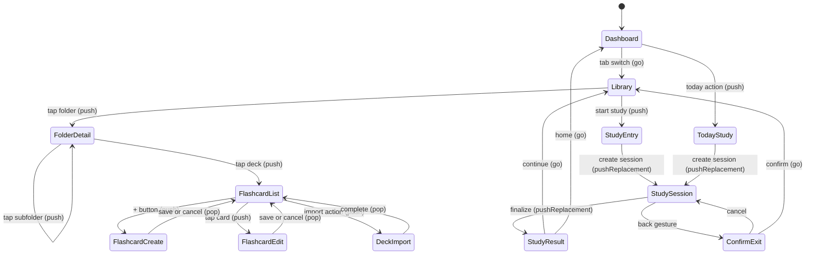

# Navigation Flow

## Source files to inspect

- `lib/app/router/app_router.dart`
- `lib/app/router/route_names.dart`
- `lib/presentation/features/**/routes/*.dart`
- `lib/app/app_shell.dart`

## Router contract

- Use GoRouter.
- Use existing `RouteNames` and `RoutePaths`.
- Do not hardcode route strings in widgets.
- Add route constants before adding new routes.
- Keep shell navigation visibility correct.

## Top-level destinations

Bottom-nav order (design redesign): **Home · Library · Search · Progress · Settings** (five tabs).
Search is a primary, thumb-reachable destination, not a top-app-bar icon; the nav bar splits its
items evenly (`.bottom-nav-item flex:1 1 0`).

| Path        | Responsibility           | Shell visible |
|-------------|--------------------------|---------------|
| `/home`     | Dashboard                | Yes           |
| `/library`  | Library                  | Yes           |
| `/search`   | Global search (folders/decks/flashcards), bottom search dock | Yes |
| `/progress` | Progress                 | Yes           |
| `/settings` | Settings hub             | Yes           |

Current V1 app boot redirects `/` to `RouteDefaults.initialLocation = RoutePaths.library`. This is
the existing app entry and must not be replaced by an onboarding wizard in V1. Dashboard remains a
top-level destination, but changing the default entry to `/home` requires a dedicated navigation
task with route tests and doc updates.

**Shell implementation (WBS 1.2.6).** The five top-level destinations are branches of a
`StatefulShellRoute.indexedStack` hosted by `MxAppShell` (`lib/app/app_shell.dart`), so each tab
keeps its own navigation stack. The shell renders the shared `MxBottomNav`; tab switches use
`navigationShell.goBranch(index, initialLocation: reTapActiveTab)` so re-tapping the active tab
returns it to its branch root. Each destination renders a `RoutePlaceholder` until its real screen
ships; feature route registries compose into the matching branch as screens land. Routes whose
"Shell visible" is **No** (e.g. detail/study/search pushed over the root navigator) sit outside the
branches.

## Settings routes

| Path                      | Responsibility                                                                                                             | Shell visible |
|---------------------------|----------------------------------------------------------------------------------------------------------------------------|---------------|
| `/settings/account`       | Account linking + Drive sync                                                                                               | No            |
| `/settings/learning`      | Learning settings (daily goal, reminder, tags, future study defaults)                                                     | No            |
| `/settings/learning/tags` | Tag management (new; see `docs/business/tags/tag-system.md` and wireframe `docs/wireframes/22-settings-tag-management.md`) | No            |
| `/settings/audio-speech`  | Audio & speech settings (Korean / English tabs, voice list, sliders, preview)                                             | No            |

Route name constants (from `lib/app/router/route_names.dart`): `RouteNames.settings`,
`RouteNames.settingsAccount`, `RouteNames.settingsLearning`, `RouteNames.settingsLearningTags`,
`RouteNames.settingsAudioSpeech`. Path segment constants: `RoutePaths.settingsAccountSegment`,
`RoutePaths.settingsLearningSegment`, `RoutePaths.settingsLearningTagsSegment`,
`RoutePaths.settingsAudioSpeechSegment`.

## Library routes

| Route responsibility      | Route pattern                                                                                                                                                                                                                                                                           | Shell visible |
|---------------------------|-----------------------------------------------------------------------------------------------------------------------------------------------------------------------------------------------------------------------------------------------------------------------------------------|---------------|
| Folder detail             | `/library/folder/:id`                                                                                                                                                                                                                                                                   | Yes           |
| Flashcard list            | `/library/deck/:deckId/flashcards`                                                                                                                                                                                                                                                      | Yes           |
| Flashcard list (filtered) | `/library/deck/:deckId/flashcards?filter={active\|suspended\|buried\|due}&tag={t1,t2}`                                                                                                                                                                                                  | Yes           |
| Flashcard create          | `/library/deck/:deckId/flashcards/new`                                                                                                                                                                                                                                                  | No            |
| Flashcard edit            | `/library/deck/:deckId/flashcards/:flashcardId/edit`                                                                                                                                                                                                                                    | No            |
| Flashcard history         | `/library/deck/:deckId/flashcards/:flashcardId/history` (Current V1 — opens `CardHistoryScreen` from a card's row action; read-only attempt timeline + reset progress)                                                                                                                    | No            |
| Deck import               | `/library/deck/:deckId/import`                                                                                                                                                                                                                                                          | No            |
| Library search            | In-place folder search inside Library Overview (bottom search-dock toggled by the app-bar `Icons.search`; `librarySearchActiveProvider` → `LibrarySearchDock`). No dedicated route in current code. A top-level global Search destination (`/search`) is introduced by the design redesign — see §Top-level destinations and `docs/business/search/global-search.md`                                                                                                  | n/a (in-place) |
| Study entry               | `/library/study/:entryType/:entryRefId` (Current entryType: `deck` \| `folder`; `tag` is Blocked/Future). **WP-SR1a:** `StudyEntryScreen` resolves the scope via `ResolveStudyEntryStartUseCase` (no silent resume) and renders preparing / a generic empty surface (per-reason matrix = WP-SR1b) / Resume-or-Start-over / error, and `pushReplacement`s to `/library/study/session/:sessionId` after auto-creating a session for an eligible scope. The `?study_type=` override + the `today` route are built (**WP-SR1b-1**); the per-reason empty matrix is **WP-SR1b-2**; the deck/folder screen CTAs that link here stay **Future** | No            |
| Today study               | `/library/study/today` (**WP-SR1b-1**) — the literal `today` route opens `StudyEntryScreen` with a global `today` scope (due review across all decks, null ref id); same gate behavior as scoped study                                                                                                                                                                                                    | No            |
| Study session             | `/library/study/session/:sessionId` — **built (WP-SR2..SR4b):** `StudySessionScreen` loads the review queue and renders the immersive ✕ shell + the both-sides **swipe-grade review surface** (right → `perfect`, left → `forgot`), the mid-session **exit-confirm** (WP-SR4a), and the long-press **card-actions** sheet (Bury / Suspend, WP-SR4b). Finish finalizes then `pushReplacement`s to the result route (WP-SR5a)                                                                                                                                                          | No            |
| Study result              | `/library/study/session/:sessionId/result` — **built V1 (WP-SR5a):** `StudyResultScreen` reads `LoadStudySessionResultUseCase` and renders the completion hero + the Correct / Wrong / Answered counts + **Done → origin via `go`** (deck scope → that deck's flashcard list, else Dashboard; never `pop`, so the result is not kept in the back stack). The mock-`17` accuracy ring, Goal & streak, "Due next", and "Keep studying" are Future; the status-driven **save-failed / defensive** states are WP-SR5b                                                                                                                                                              | No            |

Notes:

- **Flashcard create / edit are Current (WP-FL2a, 2026-06-22):** `RouteNames.flashcardCreate`
  (`new`) and `RouteNames.flashcardEdit` (`:flashcardId/edit`) are registered as children of the
  deck flashcard-list route (`folder_routes.dart`) and open `FlashcardEditorScreen` (mock `07`/`08`
  shell: X/Save app bar + breadcrumb + FRONT/BACK + validation). A card-row tap → edit, the add-card
  FAB / empty CTA → create (`runAddCard`/`runEditCard` `pushNamed`). V1 shell is front/back only; the
  Details expander + full state matrix = WP-FL2b. The "Shell visible: No" intent is honored once an
  app-shell bottom-nav exists (move the editor to the root navigator then); no bottom-nav is built yet.
- Query-string filters on the flashcard list are application conventions; verify GoRouter
  declarations in `lib/presentation/features/**/routes/*.dart`.
- The `tag` entry type is Blocked/Future until `StudyEntryType.tag` and tag-scope queries are
  promoted.
- Flashcard history is Current: `RouteNames.flashcardHistory` /
  `RoutePaths.flashcardHistoryTemplate`
  (`/library/deck/:deckId/flashcards/:flashcardId/history`), pushed over the shell from the
  root navigator (shell hidden), entered via the flashcard row-action sheet ("View history").
- Library search (current code): in-place folder search inside Library Overview, toggled by the
  app-bar search icon (`librarySearchActiveProvider` → bottom `LibrarySearchDock` mounted in the
  `bottomNavigationBar` slot). There is **no**
  dedicated search route or `RouteNames.librarySearch` / `RoutePaths.librarySearchTemplate` constant
  in the current codebase; the `GlobalSearchUseCase` / `SearchRepository` domain+data layer exists
  but is not yet wired to any screen. The design redesign promotes global search to a **top-level
  `/search` destination** with a bottom-anchored search dock; that route and screen are introduced
  by the redesign work (see `docs/business/search/global-search.md`). The tags result section,
  recent searches, and popular-tags landing remain Future Proposal pending the tag subsystem +
  a `shared_preferences` dependency.
- Folder Detail study entry points (Study folder / Today / Resume banner) are **Future — not
  built** (`folder_detail_screen.dart` documents the study layer as Future). Target behavior when
  built: Study folder and Today route through the Study Entry gate (`entry_type=folder`, with
  `study_type=srs_review` for Today); the Resume banner opens the existing `study/session/:id`
  directly without re-entering the gate or creating a session. Folder Detail never creates a
  session itself.
- Flashcard List study entry points (Study deck / Today / Resume banner) are **Future — not
  built**. Target behavior when built: Study deck and Today route through the Study Entry gate
  (`entry_type=deck`, with `study_type=srs_review` for Today — never global `entry_type=today`);
  the Resume banner opens the existing `study/session/:id` directly without re-entering the gate
  or creating a session. Flashcard List never creates a session itself.
- The `?study_type=` query parameter is **Current (WP-SR1b-1)** — the gate parses it via
  `StudyType.fromStorage` (canonical `new_cards` / `srs_review`) to override the entry default
  (`deck`/`folder` → new, `today` → review); an unrecognized value surfaces the gate error state.
  The in-screen CTA surfaces that would set it stay Future.
- Study Session is a **placeholder shell (WP-SR1a)** — `StudySessionScreen` renders the immersive ✕
  shell over a placeholder. The both-sides swipe-grade review surface, Previous/Next, exit-confirm,
  Finish Session, and the finalize→result redirect are **not built** (WP-SR2..WP-SR5).
- Current V1 note: the Study Entry routes are now real screens that start or resume persisted
  sessions, render the empty-scope matrix when no eligible cards exist, and use
  `pushReplacement` for the session redirect. When a resumable session exists, the gate shows an
  explicit Resume / Start over / Back choice instead of silently creating a new session.

## Breadcrumb trail (nested screens)

Design redesign: nested Library screens (Folder detail, Flashcard list) show a quiet ancestry
trail docked directly under the app bar, via the shared `MxBreadcrumb`
(`lib/presentation/shared/widgets/navigation/mx_breadcrumb.dart`) built by `buildLibraryBreadcrumb`
(`lib/presentation/shared/widgets/navigation/library_breadcrumb.dart`).

- Order: `🏠 Root › …ancestor folders › {current leaf}`. The first crumb is the **Root** anchor (home
  glyph `Icons.home_outlined` + `libraryRootLabel`) — the same marker the Library Overview root anchor
  shows, so the hierarchy reads consistently from the top (it is NOT labelled "Library"). Chevron
  (`›`) separators; the trail scrolls horizontally on deep paths; the last crumb is the current
  location (bold, non-tappable).
- Folder detail: the deepest folder (also the app-bar title) is the current leaf; the `breadcrumb`
  read-model list (ancestors **including** the current folder) supplies the chain.
- Flashcard list: the deck is the current leaf, so **every** folder crumb is a tappable ancestor and
  the deck name is appended as the current leaf.
- Navigation: the `Root` crumb taps to the branch root (`goNamed(RouteNames.library)`); each ancestor
  folder pushes its detail (`pushNamed(RouteNames.folderDetail, …)`).
- Hidden in search mode and until the screen's read model has loaded.

## Push vs Go rules

| Scenario                                                  | Method             | Reason                        |
|-----------------------------------------------------------|--------------------|-------------------------------|
| Folder → subfolder                                        | `push`             | Need back stack               |
| Folder → deck flashcards                                  | `push`             | Need back                     |
| Flashcard list → create                                   | `push`             | Return result                 |
| Flashcard list → edit                                     | `push`             | Return result                 |
| Deck → import                                             | `push`             | Return result                 |
| Settings hub → sub-screen (account/learning/audio-speech) | `push`             | Need back to hub              |
| Bottom nav switch                                         | `go`               | Reset tab stack               |
| Study entry → session                                     | `pushReplacement`  | No back into entry screen     |
| Session → result                                          | `pushReplacement`  | Session is done, do not stack |
| Result → origin                                           | `go`               | Reset, do not stack result    |
| Invalid route                                             | `go` to safe route | Recover, do not stack error   |

## Navigation flow diagram

## Navigation behavior

- Library opens root content.
- Folder detail opens child folders or decks.
- Deck opens flashcard list.
- Flashcard create/edit returns to flashcard list.
- Import returns to deck/folder context.
- Study entry creates or resumes persisted session.
- Study session route protects accidental exit and waits for explicit Finish Session before leaving the review screen. `?mode=review` uses the swipe-grade surface; no-mode deep links keep the recall shell.
- Study session exit confirmation leaves the session resumable; it does not cancel the session in V1. Confirmed exit pops when the stack can pop and otherwise routes to Library through the shared helper.
- Study result returns to Library or Home through existing route constants.

## Invalid route behavior

When params are invalid or entity is deleted:

- Show shared error state (`MxErrorState`).
- Do not crash.
- Do not create fake fallback data.
- Provide safe navigation action (`go` to nearest valid ancestor).

## Deep link rules

- Public routes (deep linkable): `/home`, `/library`, `/search`, `/library/folder/:id`,
  `/library/deck/:deckId/flashcards`, `/progress`, `/settings`. Search results push the
  Search-branch copies of the detail routes (`/search/folder/:id`,
  `/search/deck/:deckId/flashcards` — `RouteNames.searchFolderDetail` / `searchDeckFlashcards`) so
  the bottom nav stays on Search; deeper navigation inside a detail uses the Library-branch routes.
- Private routes (not deep linkable): study session routes, create/edit forms, import.
- Private routes accessed via deep link must redirect to safe public ancestor.

## Back behavior

| Screen           | Back behavior                                    |
|------------------|--------------------------------------------------|
| Top-level        | System exit (or to Dashboard)                    |
| Folder detail    | Pop to parent folder or library root             |
| Flashcard list   | Pop to deck's folder                             |
| Create/edit form | Pop with confirm if dirty                        |
| Study session    | Confirm dialog, then pop when possible or go Library; do not cancel in V1 |
| Study result     | Go to Library or Home, do not allow back into session |

## Agent checklist

- Route constants updated.
- Route file updated.
- Navigation call sites updated.
- Push vs go matches table.
- Shell hide/show behavior checked.
- Deep link rules respected.
- Tests or decision table updated.

## Related

**Wireframes:**

- All wireframes — each documents its `route:` in frontmatter and Navigation in/out section
- `docs/wireframes/index.md` — index of screens grouped by tree

**Schema:**

- No direct schema dependency. Routes operate on entity IDs.

**Decision table:**

- `docs/decision-tables/memox-core-decision-table.md` rows under "Navigation" (push vs go, invalid
  route recovery, deep link rules)

**Glossary terms:**

- `docs/business/glossary.md` → "push", "go", "pushReplacement" semantics

**Related business specs:**

- Every business spec that introduces a route (most of `docs/business/**`)
- `docs/business/resume/resume-session.md` — entry gate uses `pushReplacement` so back returns to
  caller
- `docs/business/study/study-flow.md` — `/library/study/...` family

**Source files to inspect:**

- `lib/app/router/route_names.dart`
- `lib/app/router/route_paths.dart`
- `lib/app/router/app_router.dart`
- `lib/app/router/redirect.dart`
