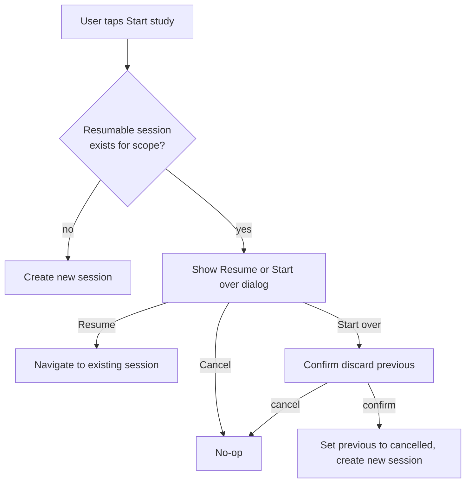

---
last_updated: 2026-05-28
applies_to: resuming in-progress study sessions, conflict between resume and new session
---

# Resume Session

## Purpose

A study session can be interrupted at any moment (low battery, incoming call, app switch, crash).
The user must be able to pick up exactly where they left off, with zero ceremony. This document
spec'd the surfaces and rules.

## Source files to inspect

- `lib/data/datasources/local/drift/study_sessions.drift`
- `lib/data/datasources/local/drift/study_session_items.drift`
- `lib/domain/study/usecases/**` (look for resume/create session use cases)
- `lib/presentation/features/dashboard/**`
- `lib/presentation/features/study/**`
- `docs/business/study/study-flow.md` (session lifecycle)

## Definition

A "resumable session" is a study session whose status is `in_progress` (see
`docs/business/glossary.md`).

Status `draft` is treated as resumable too, but V1 never persists it: sessions are created
directly as `in_progress` (`_persistSession` in
`lib/data/repositories/study_repo_impl_study_session.dart`).

Statuses `completed`, `cancelled`, and `failed_to_finalize` are NOT resumable.
(`ready_to_finalize` is a derived UI state, not a persisted status — see
`docs/business/study/study-flow.md` §Session lifecycle.)

## Constraint

At most ONE resumable session may exist per scope at any time. Scope = `(entry_type, entry_ref_id)`.

When the user starts study on a scope that already has a resumable session, the system MUST NOT
silently create a second session.
For Study Entry V1, the gate returns a controlled `resumeRequired` state with explicit Resume /
Start over / Back actions. It does not auto-navigate to the existing session and it does not create
a duplicate session.

## Surfaces

### 1. Dashboard "Continue studying" card

If at least one resumable session exists, the Dashboard MUST show a "Continue studying" card at the
top of the screen, above any other content.

Display:

| Element       | Source                                                          |
|---------------|-----------------------------------------------------------------|
| Title         | "Continue studying" (l10n)                                      |
| Subtitle      | Scope label: deck name, folder name, or "Today's review"        |
| Progress      | "X / Y cards answered" derived from `study_session_items`       |
| Last active   | Relative time from `study_sessions.updated_at` (e.g., "2h ago") |
| Primary CTA   | "Continue" → navigates to `/library/study/session/{sessionId}`  |
| Secondary CTA | None in V1                                                      |

If multiple resumable sessions exist (e.g., user has paused 2 different deck sessions), show the
most recently updated one as the card. V1 does not show a paused-session count note because the
summary model does not expose remaining-count metadata.

### 2. Deck / folder / tag context banner (Target — NOT built in V1)

Target behavior when the user opens a screen whose scope has a resumable session (no banner
exists in the current code; see "Implementation status" below):

| Screen                                                                   | Behavior                                                                             |
|--------------------------------------------------------------------------|--------------------------------------------------------------------------------------|
| Flashcard list (`/library/deck/:deckId/flashcards`)                      | Banner at top: "You have a paused study session for this deck. [Resume] [Discard]"   |
| Folder detail (`/library/folder/:id`)                                    | Banner at top: "You have a paused study session for this folder. [Resume] [Discard]" |
| Tag-filtered flashcard list or tag management entry for the same tag set | Banner: "You have a paused study session for {tagList}. [Resume] [Discard]"          |
| Dashboard "Today" card                                                   | Replaced by "Continue today's review" if `entry_type=today` session is resumable     |

Banner uses `MxBanner` or equivalent shared widget. Banner is dismissible per-visit (not persisted)
but reappears next visit until session is finalized or cancelled.

Scope matching for tag sessions: a banner appears only when the user's current tag selection (as
represented by sorted lowercased comma-joined tag names) exactly matches the resumable session's
`entry_ref_id`.

### 3. Start study action conflict

When user taps "Start study" on a scope that already has a resumable session:

Dialog content:

| Element   | Text (l10n)                                                                                                                           |
|-----------|---------------------------------------------------------------------------------------------------------------------------------------|
| Title     | "Resume previous session?"                                                                                                            |
| Body      | "You started a study session for {scopeName} {relativeTime} ago and answered {x}/{y} cards. Resume where you left off or start over?" |
| Primary   | "Resume"                                                                                                                              |
| Secondary | "Start over"                                                                                                                          |
| Cancel    | "Cancel"                                                                                                                              |

"Start over" requires a second confirmation because it discards progress.

> **V1 note:** the Study Entry gate now surfaces a controlled
> `resumeRequired` state with explicit Resume / Start over / Back actions.
> The start-over path shows a confirmation dialog before cancelling and
> recreating the scope.

### 4. Cross-scope resume

Resumable sessions for different scopes coexist. Example:

- User pauses "Korean N5" deck session.
- User starts "Today's review" session → allowed, runs in parallel.
- Dashboard V1 shows only the latest resumable session card; a multi-session list is out of scope
  for this prompt.

## Resume use case behavior

On resume:

1. Load session record and all `study_session_items` with answered/unanswered flag.
2. Compute next item index from session state (do not re-derive from scratch; use persisted pointer
   if present, else first unanswered item by `sort_order`).
3. Open `StudySessionScreen` at the correct item.
4. Keep `study_session_items.answered_at` intact.

> **Deferred:** touching `study_sessions.updated_at` on resume is still a product idea,
> but it is not part of the current V1 recovery coverage.

The session resumes in its current `study_mode` from its `study_flow`. If the flow has multiple
modes (e.g., `new_full_cycle`), the resumed mode is whichever was active when paused, persisted via
session state.

## Cancel / discard behavior

When user discards a resumable session:

| Action                      | Outcome                                                                            |
|-----------------------------|------------------------------------------------------------------------------------|
| Discard from banner         | Confirm dialog → `study_sessions.status = cancelled`, items retained for analytics |
| "Start over" path           | Same as above, then create new session                                             |

**Implementation status (verified 2026-06-10):** Deck/folder/tag resume **banners are NOT built**
— Flashcard List and Folder Detail render no resume banner and no discard flow
(`folder_detail_screen.dart` documents the study layer as Future). The only Current discard-like
path is **Start over** on the Study Entry gate (confirm → `RestartStudySessionUseCase` cancels the
old session and creates the replacement transactionally). `CancelStudySessionUseCase` exists and
is the building block for future banner discard. The flow names from earlier revisions
(`confirmAndDiscardResumeSession`, `progressSessionActionControllerProvider`,
`studySessionDataRevisionProvider`) do NOT exist in this codebase. Tag-scoped banners remain
Future/Blocked (no `StudyEntryType.tag`).

Discarded sessions do NOT delete attempts (`study_attempts` rows are retained for analytics).
**SRS progress is NOT updated for a discarded session**: progress commits only at finalization
(see `docs/business/srs/srs-review.md` §Finalization), and a cancelled session never finalizes.
Answers given in a discarded session therefore do not count as SRS reviews. (They still count
toward the attempt-based daily-progress metric — see
`docs/business/engagement/dashboard-engagement.md`, which intentionally measures effort, not
finalized reviews.)

## Auto-expiry

A resumable session older than **30 days** stops being surfaced. **Current V1 mechanism: query
filter** — the resumable-session queries only match sessions with `started_at > now - 30 days`
(see the `SessionStatus` doc comment in `lib/domain/types/session_status.dart` and the DAO
resumable queries). The session row itself is NOT mutated; it simply no longer appears on any
resume surface.

**Adopted correction (2026-06-10, WBS 4.10.2 — NOT yet implemented):** the expiry anchor must be
`updated_at`, not `started_at`. "Not touched for 30 days" means no activity — a session the user
resumes and answers in every week is alive even when it started 31 days ago; anchoring on
`started_at` expires it mid-use. Change the DAO filter (and any future cleanup job) to
`updated_at > now - 30 days` and update the `SessionStatus` doc comment in the same change.

Target (not yet implemented): an explicit cleanup that sets expired sessions to `cancelled` on
app open with a one-time notice ("Your paused {scope} session expired and was discarded"). Until
that lands, be aware that expired sessions remain `in_progress` in the database — any new query
over sessions must apply the same 30-day filter or it will resurface them.

Rationale: prevents stale sessions from clogging UI indefinitely. 30 days is long enough to cover
travel/illness but short enough to clean up abandoned sessions.

## Edge cases

| Case                                                                             | Behavior                                                                                             |
|----------------------------------------------------------------------------------|------------------------------------------------------------------------------------------------------|
| Resumable session, but scope entity deleted (deck removed)                       | Auto-cancel on next status load. Show notice "Your paused session for a deleted deck was discarded." |
| Resumable session with all items already answered, status stuck at `in_progress` | Treat as `ready_to_finalize` on resume; transition to finalize flow immediately                      |
| Multiple sessions for same scope (data corruption)                               | Resume the most recently updated; cancel others silently. Log the anomaly.                           |
| Resume while another session is `in_progress` on same device                     | Allowed; user can have multiple paused sessions, but only one open at a time                         |
| Resume after schema migration changed item structure                             | Validate item integrity; if invalid, cancel the session with notice                                  |

## Notifications

If a resumable session is older than 1 day:

- Optional daily reminder includes "Continue your paused {scope} session" if user has notification
  permission and reminders enabled (see `docs/business/engagement/dashboard-engagement.md`).

This is opt-in via notification settings; do not push by default.

## Rules

- Resume MUST NOT create a new session; it reuses the existing one.
- Resume MUST preserve answered item state on reload.
- Resume SHOULD touch `updated_at` only if the deferred metadata-refresh behavior is explicitly promoted.
- "Continue studying" surface MUST appear before any "Start new" CTA on the same screen.
- Discard from banner surfaces MUST require explicit confirmation.
- Resume from notification deep-links to `/library/study/session/{sessionId}` directly (skip
  Dashboard).
- Two sessions for the same scope MUST NEVER coexist in active state. Enforce at session creation
  use case.

## Required UI states

- Loading: while checking for resumable sessions.
- No resumable: hide all "Continue" surfaces (no empty card).
- One resumable: show single card/banner.
- Multiple resumable: show most recent only; no count note in V1.
- Cancelled mid-resume (race): show error state, route back to safe ancestor.

## Performance

- Resumable session check runs on every Dashboard load and on every deck/folder screen open. Must be
  cheap (single index lookup on `status` + `updated_at`).
- Compute progress (`x / y` answered) via SQL aggregate, not by loading all items into memory.

## Agent rule

- Do not implement "Start study" without first checking for resumable session in the scope.
- Do not silently overwrite a resumable session by creating a new one. Always confirm.
- Auto-expiry runs only on app open, not via background task. Do not add a scheduler for this.
- Resume surfaces (Dashboard card, banner, dialog) MUST share the same query source - do not
  implement three independent checks.

## Related

**Wireframes:**

- `docs/wireframes/01-dashboard.md` — Resume card on Dashboard (always above other CTAs when
  present)
- `docs/wireframes/05-folder-detail.md` — folder-scoped resume banner
- `docs/wireframes/06-flashcard-list.md` — deck-scoped resume banner
- `docs/wireframes/12-study-entry-gate.md` — resume-or-start-over routing logic
- `docs/wireframes/24-shared-dialogs.md` §resume-or-start-over, §discard-session
- `docs/wireframes/25-shared-bottom-sheets.md` §paused-sessions

**Schema:**

- `docs/database/schema-contract.md` → `study_sessions` (`status` in_progress / draft / completed /
  cancelled / failed_to_finalize; `started_at`, `entry_type`, `entry_ref_id`)

**Decision table:**

- `docs/decision-tables/memox-core-decision-table.md` rows under "Resume session" (30-day expiry,
  scope match)

**Glossary terms:**

- `docs/business/glossary.md` → `study_sessions.status`, `entry_ref_id`, "resumable session", "
  paused session"

**Related business specs:**

- `docs/business/study/study-flow.md` — session lifecycle parent contract
- `docs/business/engagement/dashboard-engagement.md` — Dashboard Resume card consumer
- `docs/business/tags/tag-system.md` — tag-scope `entry_ref_id` format (sorted, comma-joined,
  lowercased)
- `docs/business/navigation/navigation-flow.md` — resume navigates with `push` to session; entry
  gate uses `pushReplacement`

**Source files to inspect (verified 2026-05-28):**

- Use cases live inside `lib/domain/study/usecases/study_usecases.dart`:
    - `StartStudySessionUseCase` — start gate; returns `resumeRequired` when a resumable session
      exists for the scope (no silent resume, no duplicate session).
    - `LoadDashboardResumeSessionSummaryUseCase` — Dashboard "Continue studying" card data
      (latest resumable session summary).
    - `LoadStudySessionReviewUseCase` — loads a persisted session + items for an explicit resume.
    - `CancelStudySessionUseCase` — covers the "discard" path (sets status = `cancelled`).
    - `RestartStudySessionUseCase` — restart-from-scratch path that validates scope/status,
      cancels the old session, and creates the replacement in one transaction.
    - There is NO `ResumeStudySessionUseCase` class; resume = open the existing session via the
      session route.
- Repository: `lib/data/repositories/study_repo_impl.dart` +
  `lib/data/repositories/study_repo_impl_study_session.dart` (`findResumableSession`,
  `findLatestResumableSessionSummary`).
- DAO: `lib/data/datasources/local/daos/study_session_dao.dart` (resumable queries with the
  30-day filter).

> **Drift note**: earlier revisions referenced `find_resumable_session_usecase.dart`,
`discard_session_usecase.dart`, `study_session_repository.dart`,
`ResumeStudySessionUseCase`, and `study_repo_impl_helpers.dart`. None of those paths exist
> today. The behaviors live in the methods listed above.

