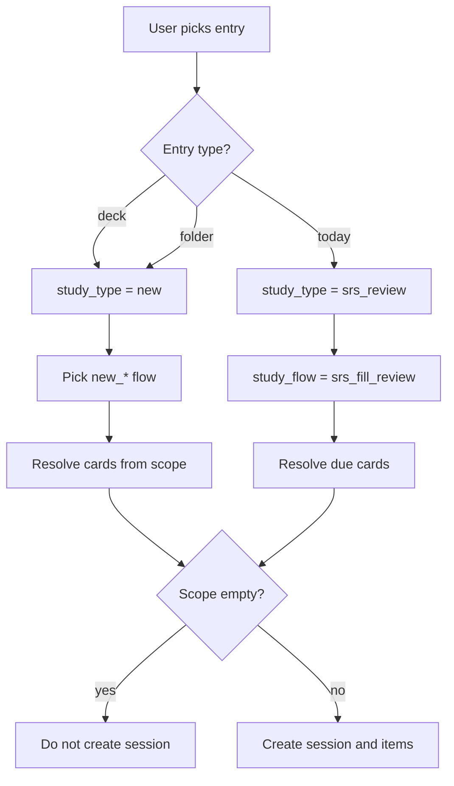
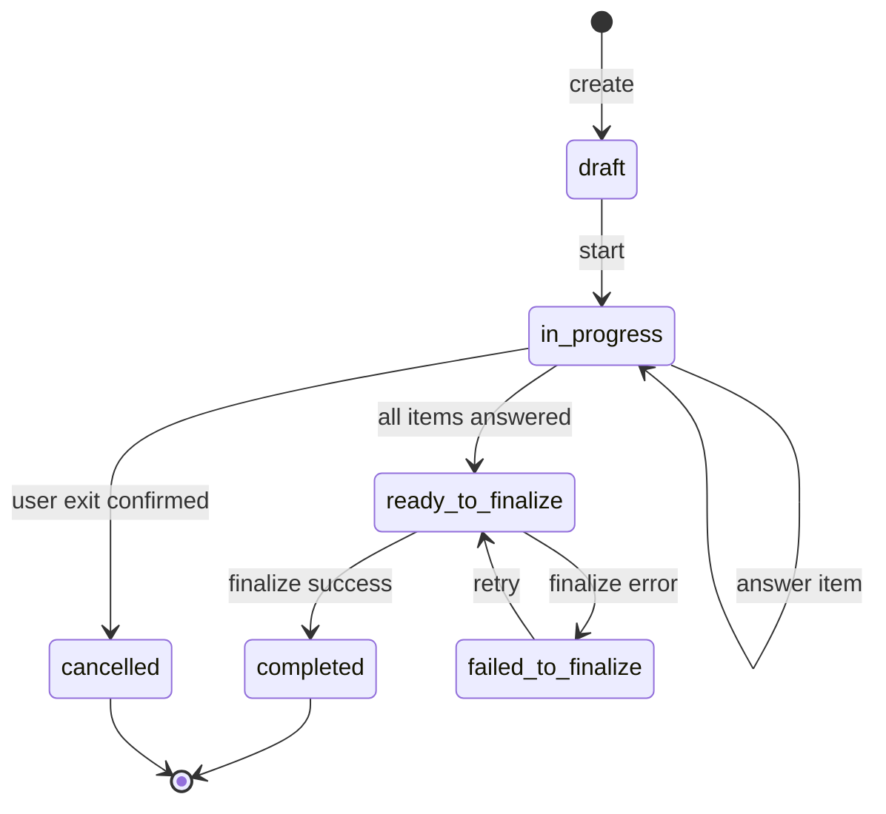

# Study Flow

## Source files to inspect

- `lib/presentation/features/study/**`
- `lib/domain/**study**`
- `lib/data/**study**`
- `lib/data/datasources/local/tables/study_sessions_table.dart`
- `lib/data/datasources/local/tables/study_session_items_table.dart`
- `lib/data/datasources/local/tables/study_attempts_table.dart`

## Entry types

See `docs/business/glossary.md` for the distinction between entry type, study type, study flow, and study mode.

| Entry type | Meaning | Requires entry_ref_id | Spec |
| --- | --- | --- | --- |
| `deck` | Study cards from one deck | Yes (deck id) | This doc |
| `folder` | Study cards from a folder recursively | Yes (folder id) | This doc |
| `today` | Study/review today's due cards (all scopes) | No | This doc + `docs/business/engagement/dashboard-engagement.md` |
| `tag` | Study cards across all decks matching one or more tags | Yes (comma-joined lowercased tag names, e.g., `"weak,grammar"`) | `docs/business/tags/tag-system.md` |

## Study types

| Type | Meaning |
| --- | --- |
| `new` | New learning |
| `srs_review` | Due-card review |

## Study flows

| Flow | Modes sequence | Default for |
| --- | --- | --- |
| `new_full_cycle` | review → match → guess → recall → fill | New cards, full learning |
| `new_review_only` | review | Quick browse |
| `new_match_only` | match | Targeted practice |
| `new_guess_only` | guess | Targeted practice |
| `new_recall_only` | recall | Targeted practice |
| `new_fill_only` | fill | Targeted practice |
| `srs_fill_review` | fill | All SRS review |

## Study modes

| Mode | Direction | Interaction |
| --- | --- | --- |
| `review` | both sides shown | Front and back rendered together on one card; user swipes (right = perfect, left = forgot). No reveal step. |
| `match` | both sides shown (board) | A 5-pair board (10 cells: 5 fronts + 5 backs of the same 5 cards). User taps a cell, then taps its pair. Per-pair persistence; one board per 5 cards. |
| `guess` | front → back | Show front; pick correct back from 5 rich option cards (title + description snippet). Auto-advance countdown on commit. |
| `recall` | front → back | Show front, tap "Show answer" to reveal back, self-grade with Forgot / Got it. **No text input in v1**; typed-answer recall is a Future Proposal. |
| `fill` | front production | Show back as definition / hint; type front in a plain free-text input. Strict character match; "Mark correct" override path. Optional Hint button taints result to max `recovered`. |

Direction notes:

- `review` and `match` cover the "both sides visible" pedagogy at different paces (1 card single-stream vs 5-pair board).
- `guess` and `recall` cover front→back recognition at increasing effort (multiple-choice vs free recall).
- `fill` is the only production-direction mode in v1 (user produces the front).
- See wireframes `docs/wireframes/13-study-session-review.md` through `docs/wireframes/17-study-session-fill.md` for full UI details.
- Recall mode in v1 is **flip-card self-grade**, not typed recall. The typed variant is a Future Proposal and would land as a separate mode (`recall_typed`) rather than overloading `recall`.

## Entry to flow resolution

## Session lifecycle

See `docs/business/glossary.md` for status definitions.

## Rules

- Study session must be persisted.
- Empty scope must not create session (see "Empty scope matrix" below for all cases).
- A missing `flashcard_progress` row must not block New Study. Treat the
  flashcard as a new active card and repair/upsert progress on finalization.
- Deck entry requires deck id.
- Folder entry requires folder id.
- Today entry does not require entry ref id.
- Folder study collects cards recursively from all descendant decks.
- SRS review uses `srs_fill_review`.
- Attempts must be persisted.
- Active session must be resumable (see `docs/business/resume/resume-session.md`).
- Exit from active session requires confirmation.
- Finalization failure must preserve data (status = `failed_to_finalize`).
- Only one active session per scope at a time. Resume existing instead of creating new (see `docs/business/resume/resume-session.md`).

## Empty scope matrix

Every "Start study" trigger must validate scope content BEFORE creating a session. The exact rejection message and CTA depend on the case.

| Entry | Study type | Condition | UI behavior | l10n key prefix |
| --- | --- | --- | --- | --- |
| `deck` | `new` | Deck has zero flashcards | Show empty state with "Add flashcards" CTA. Do not create session. | `studyEmpty_deck_noCards` |
| `deck` | `srs_review` | Deck has zero flashcards | Same as above | `studyEmpty_deck_noCards` |
| `deck` | `srs_review` | Deck has cards but zero due now | Show empty state "All caught up. Next due in {relativeTime}." with "Study new instead" CTA → switches to `new_*` flow. | `studyEmpty_deck_noDueCards` |
| `folder` | `new` | Folder has zero descendant flashcards | Show empty state with "Add a deck" CTA → opens folder. | `studyEmpty_folder_noCards` |
| `folder` | `srs_review` | Folder descendants have zero due cards | Show empty state "All caught up for this folder. Next due in {relativeTime}." with "Study new instead" CTA. | `studyEmpty_folder_noDueCards` |
| `today` | `srs_review` | No due cards across user's data | Show empty state "All done for today!" with motivational message. Show streak status (see `docs/business/engagement/dashboard-engagement.md`). | `studyEmpty_today_allDone` |
| `today` | `srs_review` | User has zero flashcards at all | Show empty state "You haven't created any flashcards yet." with "Create your first deck" CTA. | `studyEmpty_today_noContent` |
| `tag` | Any | Zero cards match selected tags (across all decks) | Show empty state "No cards have all the selected tags." with "Adjust tags" CTA → returns to tag picker. | `studyEmpty_tag_noCards` |
| `tag` | `srs_review` | Matching cards exist but none due | Show empty state "All caught up for these tags. Next due in {relativeTime}." with "Study new instead" CTA. | `studyEmpty_tag_noDueCards` |
| Any | Any | All cards are buried for today (see `docs/business/study-actions/bury-suspend.md`) | Show empty state "You buried all cards for today. They'll return tomorrow." with "Study new instead" CTA. | `studyEmpty_allBuried` |
| Any | Any | All cards are suspended | Show empty state "All cards are suspended. Resume some to study." with link to suspended cards list. | `studyEmpty_allSuspended` |

Rejection MUST NOT be a generic toast or error dialog. Always render dedicated empty state with actionable CTA where possible.

### Implementation status (P0-1)

| Case | Status | Source |
| --- | --- | --- |
| `studyEmpty_deck_noCards` | ✅ Implemented (Tier 1) | `lib/domain/study/usecases/study_usecases.dart` (`_rejectEmptyScope`) + `lib/presentation/features/study/widgets/empty_scope_screen.dart` |
| `studyEmpty_deck_noDueCards` | ✅ Implemented (Tier 1) | `study_usecases.dart` (`_rejectNoDueCards`) + `StudyRepo.countDueCardsInScope` / `nextDueAt` + `empty_scope_screen.dart` |
| `studyEmpty_folder_noCards` | ✅ Implemented (Tier 1) | `study_usecases.dart` (`_rejectEmptyFolder`) + `StudyRepo.countFlashcardsInScope` + `empty_scope_screen.dart` |
| `studyEmpty_folder_noDueCards` | ✅ Implemented (Tier 1) | `study_usecases.dart` (`_rejectNoDueCards`) + `StudyRepo.countDueCardsInScope` / `nextDueAt` + `empty_scope_screen.dart` |
| `studyEmpty_today_allDone` | ✅ Implemented (Tier 1) | `study_usecases.dart` (`_rejectEmptyToday`) + `StudyRepo.countDueCardsInScope` + `empty_scope_screen.dart`. Streak inset still pending (engagement use cases are `Target`). |
| `studyEmpty_today_noContent` | ✅ Implemented (Tier 1) | `study_usecases.dart` (`_rejectEmptyToday`) + `StudyRepo.countFlashcardsInScope` + `empty_scope_screen.dart` |
| `studyEmpty_tag_noCards` / `studyEmpty_tag_noDueCards` | 🔴 Blocked (Tier 2) — `StudyEntryType.tag` not yet defined; needs tag-scope queries + tag picker | `docs/business/tags/tag-system.md` |
| `studyEmpty_allBuried` / `studyEmpty_allSuspended` | ✅ Implemented (Tier 3, P0-2) | `study_usecases.dart` `_rejectEmptyScope` (allSuspended precedes allBuried) + `StudyRepo.countSuspendedInScope` / `countActiveBuriedInScope` + `empty_scope_screen.dart`. Decision rows S4f/S4g. |

## "Next due" calculation

For "no due cards" cases, the empty state displays "Next due in {relativeTime}":

- Query: `SELECT MIN(due_at) FROM flashcard_progress WHERE flashcard_id IN <scope> AND due_at > now`.
- Format: relative ("in 2 hours", "tomorrow", "in 3 days") via l10n.
- If no future due exists either (all cards at max box with very far due), omit the line and show only "All caught up.".

## Retry behavior

- Incorrect answer creates attempt.
- Retry behavior depends on selected flow/mode.
- Retry state must be persisted through session items or domain-supported queue.
- UI must not be the only source of retry state.

## Performance

- Session item queue >100 cards: paginate item loading.
- Audio playback (TTS): pre-warm next item's audio if available.
- Attempt persistence: write-through, do not batch in widget memory.

## Agent rule

Do not keep active study progress only in provider memory. Every answer must persist before UI advances.

## Related

**Wireframes:**

- `docs/wireframes/12-study-entry-gate.md` — pre-session router + empty matrix
- `docs/wireframes/13-study-session-review.md` — review mode (front→back flip)
- `docs/wireframes/14-study-session-match.md` — match mode (front→back multiple choice)
- `docs/wireframes/15-study-session-guess.md` — guess mode (front → back, rich option cards)
- `docs/wireframes/16-study-session-recall.md` — recall mode (free text)
- `docs/wireframes/17-study-session-fill.md` — fill mode (char-by-char)
- `docs/wireframes/18-study-result.md` — end-of-session summary
- `docs/wireframes/25-shared-bottom-sheets.md` §scope-picker, §paused-sessions

**Schema:**

- `docs/database/schema-contract.md` → `study_sessions`, `study_session_items`, `study_attempts` (with `box_before` / `box_after`)

**Decision table:**

- `docs/decision-tables/memox-core-decision-table.md` rows S1-S4i (session lifecycle, empty scope matrix, mode availability)

**Glossary terms:**

- `docs/business/glossary.md` → `entry_type`, `study_type`, `study_flow`, `study_mode`, `entry_ref_id`

**Related business specs:**

- `docs/business/srs/srs-review.md` — box transitions on result
- `docs/business/resume/resume-session.md` — paused session lifecycle
- `docs/business/study-actions/bury-suspend.md` — bury/suspend integration into queue
- `docs/business/tags/tag-system.md` — `entry_type=tag` `entry_ref_id` format
- `docs/business/engagement/dashboard-engagement.md` — `today` entry and goal/streak integration
- `docs/business/tts/tts-settings.md` — playback gating per mode
- `docs/business/navigation/navigation-flow.md` — `/library/study/...` routes + `pushReplacement` rule

**Source files to inspect:**

- `lib/data/datasources/local/tables/study_sessions_table.dart`
- `lib/data/datasources/local/tables/study_session_items_table.dart`
- `lib/data/datasources/local/tables/study_attempts_table.dart`
- `lib/domain/study/usecases/study_usecases.dart` (the entire study lifecycle: start, resume, restart, answer, skip, cancel, finalize, retry-finalize). There is **no `lib/domain/usecases/study/**` directory** — study use cases live under `lib/domain/study/usecases/`, parallel to the other feature use-case files in `lib/domain/usecases/`.
- `lib/domain/study/strategy/` (`study_strategy.dart`, `study_mode_strategy.dart`, `study_strategy_factory.dart`) — mode skip rules and per-flow-type behavior. **There is no dedicated `flow_validator.dart`**; validation is part of the active strategy.
- `lib/presentation/features/study/**`
