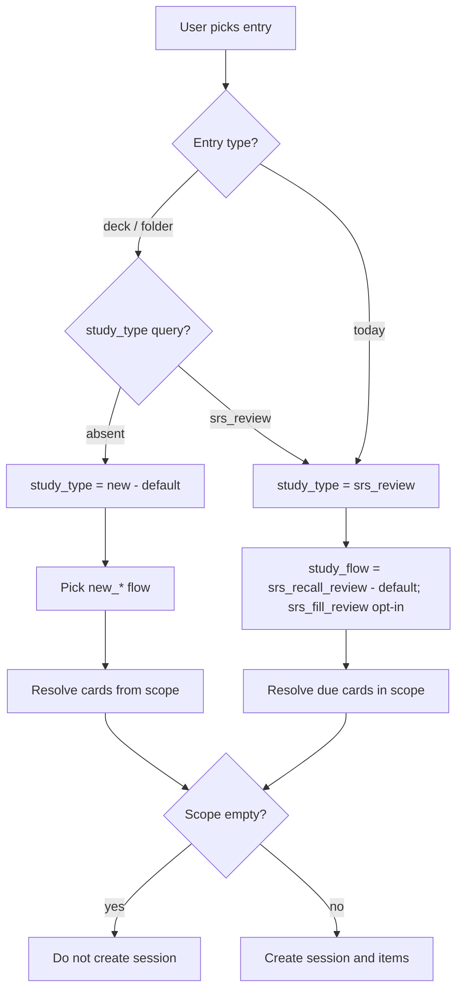
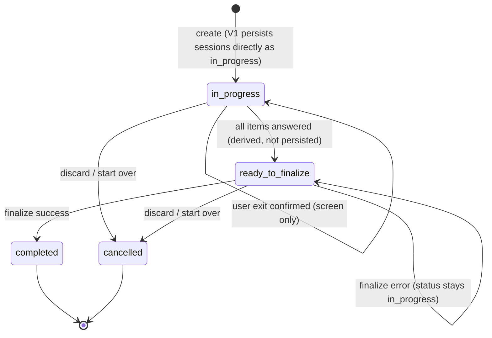

# Study Flow

## Source files to inspect

- `lib/presentation/features/study/**`
- `lib/domain/**study**`
- `lib/data/**study**`
- `lib/data/datasources/local/daos/study_session_dao.dart`
- `lib/data/datasources/local/drift/study_sessions.drift`
- `lib/data/datasources/local/drift/study_session_items.drift`
- `lib/data/datasources/local/drift/study_attempts.drift`

## Entry types

See `docs/business/glossary.md` for the distinction between entry type, study type, study flow, and
study mode.

| Entry type | Meaning                                                | Requires entry_ref_id                                           | Spec                                                          |
|------------|--------------------------------------------------------|-----------------------------------------------------------------|---------------------------------------------------------------|
| `deck`     | Study cards from one deck                              | Yes (deck id)                                                   | This doc                                                      |
| `folder`   | Study cards from a folder recursively                  | Yes (folder id)                                                 | This doc                                                      |
| `today`    | Study/review today's due cards (all scopes)            | No                                                              | This doc + `docs/business/engagement/dashboard-engagement.md` |
| `tag`      | Study cards across all decks matching one or more tags | Yes (comma-joined lowercased tag names, e.g., `"weak,grammar"`) | `docs/business/tags/tag-system.md`                            |

## Study types

| Type         | Meaning         |
|--------------|-----------------|
| `new`        | New learning    |
| `srs_review` | Due-card review |

## Study flows

| Flow              | Modes sequence                         | Default for              |
|-------------------|----------------------------------------|--------------------------|
| `new_full_cycle`  | review → match → guess → recall → fill | New cards, full learning |
| `new_review_only` | review                                 | Quick browse             |
| `new_match_only`  | match                                  | Targeted practice        |
| `new_guess_only`  | guess                                  | Targeted practice        |
| `new_recall_only` | recall                                 | Targeted practice        |
| `new_fill_only`   | fill                                   | Targeted practice        |
| `srs_recall_review` | recall                               | **All SRS review (default, adopted 2026-06-10)** — V1 runtime already resolves recall |
| `srs_fill_review` | fill                                   | SRS review, opt-in per session (Implemented) |

> **Adopted decision (2026-06-10):** SRS review defaults to **recall**, not fill. Forcing every
> due review through strict typed input (fill) — especially for Korean front text — is the
> heaviest possible interaction and would push users to skip reviews. Fill stays available as an
> opt-in flow for users who want production practice. The V1 runtime fallback
> (`StudyModeStrategyFactory` → recall) already matches this default. The fill screen itself is
> implemented and wired for explicit opt-in sessions.

## Study modes

| Mode     | Direction                | Interaction                                                                                                                                                                         |
|----------|--------------------------|-------------------------------------------------------------------------------------------------------------------------------------------------------------------------------------|
| `review` | both sides shown         | Front and back rendered together on one card; user swipes (right = perfect, left = forgot). No reveal step.                                                                         |
| `match`  | both sides shown (board) | A 5-pair board (10 cells: 5 fronts + 5 backs of the same 5 cards). User taps a cell, then taps its pair. Per-pair persistence; one board per 5 cards.                               |
| `guess`  | front → back             | Show front; pick correct back from 5 rich option cards (title + description snippet). Auto-advance countdown on commit.                                                             |
| `recall` | front → back             | Show front, tap "Show answer" to reveal back, self-grade with Forgot / Got it. **No text input in v1**; typed-answer recall is a Future Proposal.                                   |
| `fill`   | front production         | Show back as definition / hint; type front in a plain free-text input. Strict character match; "Mark correct" override path. Optional Hint button taints result to max `recovered`. |

Direction notes:

- `review` and `match` cover the "both sides visible" pedagogy at different paces (1 card
  single-stream vs 5-pair board).
- `guess` and `recall` cover front→back recognition at increasing effort (multiple-choice vs free
  recall).
- `fill` is the only production-direction mode in v1 (user produces the front).
- See wireframes `docs/wireframes/13-study-session-review.md` through
  `docs/wireframes/17-study-session-fill.md` for full UI details.
- Recall mode in v1 is **flip-card self-grade**, not typed recall. The typed variant is a Future
  Proposal and would land as a separate mode (`recall_typed`) rather than overloading `recall`.

## Entry to flow resolution

Defaults: `deck`/`folder` entries default to `study_type = new` but accept
`?study_type=srs_review` for a scope-limited due review (see the empty scope matrix rows
`deck + srs_review` / `folder + srs_review` and
`docs/business/navigation/navigation-flow.md`). `today` is always `srs_review`.

## Session lifecycle

See `docs/business/glossary.md` for status definitions.

Status notes (see `docs/business/glossary.md` §Status terms):

- `ready_to_finalize` is a **derived UI state** ("all items answered"), not a persisted
  `study_sessions.status` value.
- `draft` exists in the `SessionStatus` enum but V1 persists new sessions directly as
  `in_progress` (`_persistSession`); treat `draft` as resumable if encountered.
- `failed_to_finalize` exists in the enum but is **never written in V1**: a failed finalize
  rolls back and the session stays `in_progress` (decision row S10).

## Rules

- Study session must be persisted.
- Empty scope must not create session (see "Empty scope matrix" below for all cases).
- A missing `flashcard_progress` row must not block New Study. Treat the
  flashcard as a new active card and repair/upsert progress on finalization.
- Deck entry requires deck id.
- Folder entry requires folder id.
- Today entry does not require entry ref id.
- Folder study collects cards recursively from all descendant decks.
- SRS review defaults to `srs_recall_review` (recall); `srs_fill_review` is opt-in (Target).
- **Session batch limit (BE V1, WBS 4.2.4):** a session contains at most `maxSessionItems`
  eligible cards (default 20; named constant). When the scope has more eligible cards, the
  backend takes the first batch (due-date order for review, sort order for new) before
  persisting `study_session_items`.
  Rationale: unbounded recursive folder scopes create 300-card sessions that combine badly with
  all-or-nothing finalization — abandoning at card 150 yields zero SRS credit. Small batches cap
  the loss and create completion moments.
- **Daily new-card limit (BE V1, WBS 4.5.10):** new-card study is capped per local day from the
  persisted `study_session_items` of earlier new-card sessions. The quota uses the local-day window
  (`start <= started_at < end`), cancelled new-card sessions still consume quota in V1, and
  `srs_review` sessions are not reduced by this cap.
- **Today-session snapshot rule:** session items are snapshotted at creation. Cards that become
  due AFTER the session was created are NOT injected into the running session; they surface on
  the Dashboard/gate after finalization. The all-done empty state means "all due at session
  start" — copy must not promise the rest of the day.
- Attempts must be persisted.
- Active session must be resumable (see `docs/business/resume/resume-session.md`).
- The Study Session route (`/library/study/session/:sessionId`) is a real
  persisted review screen in V1: `?mode=review` renders the swipe-grade
  review surface with both sides visible, the shared shell without `mode`
  keeps the recall reveal/self-grade flow, both flows persist before
  advancing, and explicit Finish Session still pushes the real result screen.
- When a persisted session reloads, answered items remain answered, the review
  controller starts at the first unanswered item, and a fully answered session
  opens in a finish-ready state instead of creating a new session.
- Study Entry V1 must not silently resume an existing scope session. If a
  resumable session exists, the gate returns a controlled `resumeRequired`
  state with explicit Resume / Start over / Back actions. Resume opens the
  existing session, and Start over confirms before cancelling that session
  and re-entering the same scope so a duplicate session is not created
  silently.
- The Study Session self-grade V1 path reveals the current card, lets the user
  tap Forgot / Got it, persists the attempt plus `study_session_items.answered_at`,
  and keeps `flashcard_progress` unchanged until finalization.
- Review mode V1 shows both sides on one card, grades by swipe (or the shared
  card-actions sheet's edit/bury/suspend controls), and refreshes the current
  session view after a buried or suspended card is removed from the queue.
- In-session bury/suspend is a separate active-session action, not an answer:
  it removes the matching `study_session_items` row from the current queue,
  does not create a `study_attempts` row, preserves `current_box` / `due_at`
  / `review_count` / `lapse_count`, updates only `buried_until` or
  `is_suspended`, and touches `study_sessions.updated_at`.
- The session header now **persists** its phase plan and active phase:
  `study_sessions.study_flow` (the `StudyFlow`, written at create from
  `StudyFlowResolver.resolve(...)`) and `study_sessions.current_mode` (the
  active phase, written as `study_flow.firstMode` at create). New deck/folder
  sessions with no explicit mode resolve to `new_full_cycle`. **Backbone only
  in this iteration:** the columns are written but the FE/review controller
  does not yet consume `current_mode` — it still drives the active mode from
  the route `?mode=` (or the recall fallback below). Per-phase advancement that
  reads `current_mode` is pending (WBS 4.5.12).
- The review controller resolves a domain `StudyModeStrategy` for the current
  session. Because V1 does not yet consume the persisted `current_mode`, it
  uses `StudyMode.recall` as the documented fallback in
  `StudyModeStrategyFactory.resolve(...)` when no route mode is supplied.
  Explicit resolution supports `review`, `guess`, `fill`, and `match`; the
  active review shell still falls back to recall when no mode is supplied.
- `StudyModeStrategy` is a **sealed** base
  (`lib/domain/study/modes/study_mode_strategy.dart`) with three interaction
  families declared in the same file: `BinaryGradeStudyModeStrategy`
  (recall / review / guess — one card collapses to a binary pass/fail mapped
  to an `AttemptResult` via `mapGotItAction` / `mapForgotAction`),
  `TypedAnswerStudyModeStrategy` (fill — terminal result computed by the
  strict typed-answer evaluator), and `BoardStudyModeStrategy` (match —
  append-only pair evaluations, terminal attempts derived at finalization,
  no per-card grading API). Callers pattern-match on the family instead of
  branching on `StudyMode`; mode → strategy mapping lives only in
  `StudyModeStrategyFactory.resolve(...)` (exhaustive `switch`, so an
  unwired new mode fails at compile time). Fill and Match expose no
  Forgot / Got-it methods at all (previously they threw
  `UnsupportedError`).
- Finalization is explicit. The user must tap Finish Session after all items
  are answered; the app then commits progress transactionally and navigates to
  the real result screen on success.
- Exit from active session requires confirmation. Confirmed exit leaves the
  screen without cancelling the session; if the route cannot pop, the app
  returns to Library through the route helper.
- Finalization failure keeps the user on the study session screen, shows a
  controlled localized error, and leaves the session open for another attempt.
- Only one active session per scope at a time. Resume existing instead of creating new (see
  `docs/business/resume/resume-session.md`).

## Empty scope matrix

Every "Start study" trigger must validate scope content BEFORE creating a session. The exact
rejection message and CTA depend on the case.

| Entry    | Study type   | Condition                                                                          | UI behavior                                                                                                                                    | l10n key prefix                |
|----------|--------------|------------------------------------------------------------------------------------|------------------------------------------------------------------------------------------------------------------------------------------------|--------------------------------|
| `deck`   | `new`        | Deck has zero flashcards                                                           | Show empty state with "Add flashcards" CTA. Do not create session.                                                                             | `studyEmpty_deck_noCards`      |
| `deck`   | `srs_review` | Deck has zero flashcards                                                           | Same as above                                                                                                                                  | `studyEmpty_deck_noCards`      |
| `deck`   | `srs_review` | Deck has cards but zero due now                                                    | Show empty state "All caught up. Next due in {relativeTime}." with "Study new instead" CTA → switches to `new_*` flow.                         | `studyEmpty_deck_noDueCards`   |
| `folder` | `new`        | Folder has zero descendant flashcards                                              | Show empty state with "Add a deck" CTA → opens folder.                                                                                         | `studyEmpty_folder_noCards`    |
| `folder` | `srs_review` | Folder descendants have zero due cards                                             | Show empty state "All caught up for this folder. Next due in {relativeTime}." with "Study new instead" CTA.                                    | `studyEmpty_folder_noDueCards` |
| `today`  | `srs_review` | No due cards across user's data                                                    | Show empty state "All done for today!" with motivational message. Show streak status (see `docs/business/engagement/dashboard-engagement.md`). | `studyEmpty_today_allDone`     |
| `today`  | `srs_review` | User has zero flashcards at all                                                    | Show empty state "You haven't created any flashcards yet." with "Create your first deck" CTA.                                                  | `studyEmpty_today_noContent`   |
| `tag`    | Any          | Zero cards match selected tags (across all decks)                                  | Show empty state "No cards have all the selected tags." with "Adjust tags" CTA → returns to tag picker.                                        | `studyEmpty_tag_noCards`       |
| `tag`    | `srs_review` | Matching cards exist but none due                                                  | Show empty state "All caught up for these tags. Next due in {relativeTime}." with "Study new instead" CTA.                                     | `studyEmpty_tag_noDueCards`    |
| Any      | Any          | All cards are buried for today (see `docs/business/study-actions/bury-suspend.md`) | Show empty state "You buried all cards for today. They'll return tomorrow." with "Study new instead" CTA.                                      | `studyEmpty_allBuried`         |
| Any      | Any          | All cards are suspended                                                            | Show empty state "All cards are suspended. Resume some to study." with link to suspended cards list.                                           | `studyEmpty_allSuspended`      |

Rejection MUST NOT be a generic toast or error dialog. Always render dedicated empty state with
actionable CTA where possible.

### Implementation status

> The rebuild re-adds this feature per slice. **BE classification** (which empty
> reason a scope resolves to) ships with **WBS 4.1.1** in
> `lib/data/repositories/study_entry_repository_impl.dart` (`_classify`) over the
> `study_entry_queries.drift` scope counts, returning a `StudyScopeEmptyReason`
> (`lib/domain/models/study_entry_eligibility.dart`). **FE rendering** of each
> empty state + CTA is pending (WBS 4.1.2 entry gate).

| Case                                                   | BE classification (WBS 4.1.1) | FE empty state (WBS 4.1.2) | Decision row |
|--------------------------------------------------------|-------------------------------|----------------------------|--------------|
| `studyEmpty_deck_noCards`                              | ✅ `deckNoCards`              | ⏳ pending                  | S4           |
| `studyEmpty_deck_noDueCards`                           | ✅ `deckNoDueCards` (+nextDue)| ⏳ pending                  | S4e          |
| `studyEmpty_folder_noCards`                            | ✅ `folderNoCards`           | ⏳ pending                  | S4b          |
| `studyEmpty_folder_noDueCards`                         | ✅ `folderNoDueCards` (+nextDue)| ⏳ pending                | S4j          |
| `studyEmpty_today_allDone`                             | ✅ `todayAllDone`            | ⏳ pending (streak inset Target) | S4c    |
| `studyEmpty_today_noContent`                           | ✅ `todayNoContent`          | ⏳ pending                  | S4d          |
| `studyEmpty_tag_noCards` / `studyEmpty_tag_noDueCards` | 🔴 Blocked — `EntryType.tag` not in the core enum; needs tag-scope queries + tag picker | 🔴 Blocked | S4h/S4i |
| `studyEmpty_allBuried` / `studyEmpty_allSuspended`     | ✅ `allBuried` / `allSuspended`| ⏳ pending                  | S4f/S4g      |

## "Next due" calculation

For "no due cards" cases, the empty state displays "Next due in {relativeTime}":

- Query:
  `SELECT MIN(due_at) FROM flashcard_progress WHERE flashcard_id IN <scope> AND due_at > now`.
- Format: relative ("in 2 hours", "tomorrow", "in 3 days") via l10n.
- If no future due exists either (all cards at max box with very far due), omit the line and show
  only "All caught up.".

## Retry behavior

- Incorrect answer creates attempt.
- Retry behavior depends on selected flow/mode. Recall/Review/Guess/Fill V1 records exactly one
  attempt per item (a second answer on an answered item is rejected). Match persists append-only
  evaluations and derives one terminal attempt per item at finalization; multi-attempt retry for
  other modes remains Target for future modes.
- Re-queue/retry modes follow the **adopted first-attempt-decides-SRS contract** in
  `docs/business/srs/srs-review.md` (§Box transition table): a first-attempt `forgot` demotes the
  card even when the re-queued pass completes the session; the re-queue IS the in-session
  relearning step.
- **Answer re-grade before finalization (Target, WBS 4.4.3):** until the session is finalized,
  the user may change the grade of an answered item (mistap protection). Implementation appends a
  correcting attempt; the SRS classifier handles the sequence per the adopted contract. Requires
  relaxing the current "reject second answer" rule in `recordStudySessionAnswer` together with
  the C1 classifier change — ship the two together.
- Match uses the same local-evaluation principle, but it persists append-only board evaluations
  rather than terminal attempts until finalization derives the SRS history.
- Retry state must be persisted through session items or domain-supported queue.
- UI must not be the only source of retry state.

## Performance

- Session item queue >100 cards: paginate item loading.
- Audio playback (TTS): pre-warm next item's audio if available.
- Attempt persistence: write-through, do not batch in widget memory.

## Agent rule

Do not keep active study progress only in provider memory. Every answer must persist before UI
advances.

## Related

**Wireframes:**

- `docs/wireframes/12-study-entry-gate.md` — pre-session router + empty matrix
- `docs/wireframes/13-study-session-review.md` — review mode (both sides shown, swipe grade)
- `docs/wireframes/14-study-session-match.md` — match mode (5-pair board)
- `docs/wireframes/15-study-session-guess.md` — guess mode (front → back, rich option cards)
- `docs/wireframes/16-study-session-recall.md` — recall mode (flip-card self-grade; no text input in V1)
- `docs/wireframes/17-study-session-fill.md` — fill mode (typed front, strict match)
- `docs/wireframes/18-study-result.md` — end-of-session summary
- `docs/wireframes/25-shared-bottom-sheets.md` §scope-picker, §paused-sessions

**Schema:**

- `docs/database/schema-contract.md` → `study_sessions`, `study_session_items`, `study_attempts` (
  with `box_before` / `box_after`)

**Decision table:**

- `docs/decision-tables/memox-core-decision-table.md` rows S1-S4i (session lifecycle, empty scope
  matrix, mode availability)

**Glossary terms:**

- `docs/business/glossary.md` → `entry_type`, `study_type`, `study_flow`, `study_mode`,
  `entry_ref_id`

**Related business specs:**

- `docs/business/srs/srs-review.md` — box transitions on result
- `docs/business/resume/resume-session.md` — paused session lifecycle
- `docs/business/study-actions/bury-suspend.md` — bury/suspend integration into queue
- `docs/business/tags/tag-system.md` — `entry_type=tag` `entry_ref_id` format
- `docs/business/engagement/dashboard-engagement.md` — `today` entry and goal/streak integration
- `docs/business/tts/tts-settings.md` — playback gating per mode
- `docs/business/navigation/navigation-flow.md` — `/library/study/...` routes + `pushReplacement`
  rule

**Source files to inspect:**

- `lib/data/datasources/local/drift/study_sessions.drift`
- `lib/data/datasources/local/drift/study_session_items.drift`
- `lib/data/datasources/local/drift/study_attempts.drift`
- `lib/domain/study/usecases/study_usecases.dart` (the entire study lifecycle: start, resume,
  restart, answer, cancel, finalize). A `lib/domain/usecases/study/**` directory does NOT exist —
  study use cases live under `lib/domain/study/usecases/`, parallel to the other feature
  use-case files in `lib/domain/usecases/`.
- `lib/domain/study/modes/` (`study_mode_strategy.dart`, `recall_study_mode_strategy.dart`,
  `study_mode_strategy_factory.dart`) — mode behavior contract and V1 recall fallback. **There is
  no dedicated `flow_validator.dart`**; validation is part of the active strategy.
- `lib/presentation/features/study/**`
