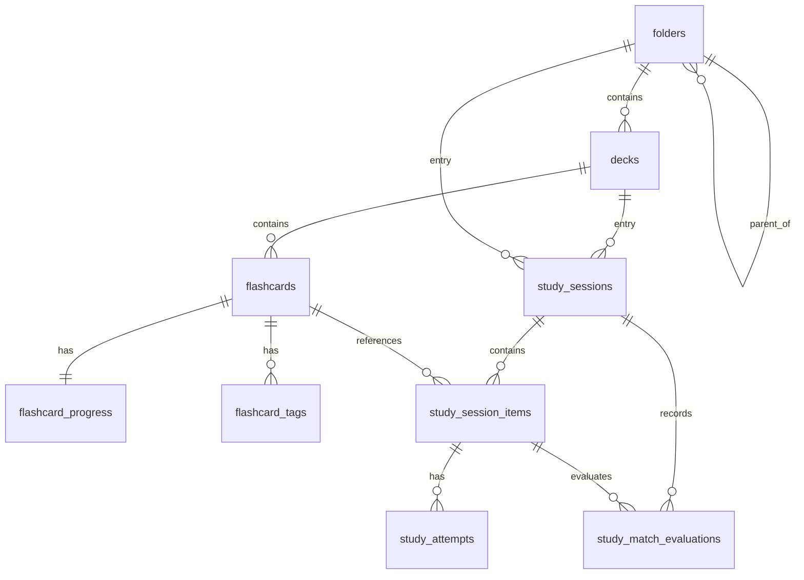

# Database Schema Contract

## Current implementation status (incremental rebuild)

The Drift data layer is being **rebuilt incrementally, per feature slice**. The
table-area and migration sections below describe the **target** schema (the
mature shape to migrate toward); they are intentionally ahead of the current
code per the "do not downgrade target concepts" rule.

**Current schema** (`AppDatabase.currentSchemaVersion`): **2** (rebuild
baseline v1 2026-06-19 WBS 1.1.5; `decks` added v2 2026-06-20 WBS 2.7.1). The
Drift layer was reset and is being re-added per feature slice. Tables shipped so
far:

| Table     | Columns (current)                                                                                                |
|-----------|------------------------------------------------------------------------------------------------------------------|
| `folders` | `id`, `parent_id` (self-FK, restrict), `name`, `content_mode`, `sort_order`, `created_at`, `updated_at`           |
| `decks`   | `id`, `folder_id` (FK→folders, cascade), `name`, `target_language` (TEXT NOT NULL DEFAULT `'korean'`), `sort_order`, `created_at`, `updated_at` + index `idx_decks_folder` |

The table below is the **target table shape** the rebuild migrates toward (the
mature schema from the prior iteration); it is intentionally ahead of the
current code per the "do not downgrade target concepts" rule:

| Table                | Columns (target)                                                                                                                                                                                     |
|----------------------|-------------------------------------------------------------------------------------------------------------------------------------------------------------------------------------------------------|
| `folders`            | `id`, `parent_id` (self-FK, restrict), `name`, `content_mode`, `sort_order`, `created_at`, `updated_at`                                                                                               |
| `decks`              | `id`, `folder_id` (FK→folders, cascade), `name`, `target_language`, `sort_order`, `created_at`, `updated_at`                                                                                          |
| `flashcards`         | `id`, `deck_id` (FK→decks, cascade), `front`, `back`, `example_sentence?`, `pronunciation?`, `hint?`, `part_of_speech?`, `is_flagged`, `sort_order`, `created_at`, `updated_at`                                                    |
| `flashcard_tags`     | `flashcard_id` (FK→flashcards, cascade), `tag` + index `idx_flashcard_tags_tag`                                                                                                                     |
| `flashcard_progress` | `flashcard_id` (PK, FK→flashcards, cascade), `box_number`, `due_at?`, `buried_until?`, `is_suspended`, `review_count`, `lapse_count`, `last_studied_at?`, `last_reset_at?` + index `idx_flashcard_progress_eligibility` |
| `study_sessions`     | `id` (PK), `entry_type`, `entry_ref_id?`, `study_type`, `status`, `study_flow` (TEXT NOT NULL DEFAULT `'srs_recall_review'`; the ordered phase plan — see `docs/contracts/types-catalog.md` §StudyFlow), `current_mode?` (TEXT NULL; active phase pointer, snake_case `StudyMode`; NULL = legacy single-mode session), `started_at`, `updated_at` + index `idx_study_sessions_resumable`                                                                |
| `study_session_items` | `id` (PK), `session_id` (FK→study_sessions, cascade), `flashcard_id` (FK→flashcards, cascade), `sort_order`, `answered_at?`, `created_at`, `updated_at` + index `idx_study_session_items_session_sort` |
| `study_attempts`     | `id` (PK), `session_item_id` (FK→study_session_items, cascade), `result`, `study_mode`, `box_before`, `box_after`, `user_input?`, `duration_ms?`, `attempted_at` + index `idx_study_attempts_session_item`           |
| `card_events`        | `id` (PK), `flashcard_id` (FK→flashcards, cascade), `type` (`created`/`edited`/`audio_added`/`reset`), `occurred_at`, `detail?` + index `idx_card_events_flashcard` (Card History activity feed)           |
| `study_match_evaluations` | `id` (PK), `session_id` (FK→study_sessions, cascade), `session_item_id` (FK→study_session_items, cascade), `flashcard_id` (FK→flashcards, cascade), `board_index`, `pair_id`, `selected_front_cell_id`, `selected_back_cell_id`, `expected_front_flashcard_id`, `expected_back_flashcard_id`, `is_correct`, `attempt_order`, `evaluated_at`, `created_at` + indexes `idx_study_match_evaluations_session`, `idx_study_match_evaluations_session_item` |
| `tts_settings`       | `id` (PK, always `'default'`), `auto_play` (BOOL), `front_language` (TEXT: `'korean'`/`'english'`), `rate` (REAL), `pitch` (REAL), `volume` (REAL), `front_voice_name` (TEXT NULL) — single-row pattern; shipped v9 |

When a new table/column ships, bump `AppDatabase.currentSchemaVersion`, add an
`onUpgrade` step (`docs/database/migration-contract.md`), and update this section.

## Source files to inspect

- `lib/data/datasources/local/app_database.dart`
- `lib/data/datasources/local/drift/**` (`.drift` schema + query files — tables, indexes, SQL)
- `lib/data/datasources/local/connection/**` (platform connection)
- See `docs/database/drift-guide.md` for the `.drift` layout and how to add tables/queries.

## Rules

- Drift is the local database layer.
- Current schema version: see `AppDatabase.currentSchemaVersion`.
- Foreign keys must stay enabled (`PRAGMA foreign_keys = ON`).
- WAL mode must stay enabled (`PRAGMA journal_mode = WAL`).
- Database must not run on UI isolate. The connection is isolated under
  `lib/data/datasources/local/connection/`: native uses `LazyDatabase` +
  `NativeDatabase.createInBackground` (file path via `path_provider`); web uses `WasmDatabase`.
- Schema (tables + indexes) is defined in `.drift` files and pulled into `AppDatabase` via
  `include:`; SQL queries live in `.drift` query files. No long raw SQL strings in Dart
  (`docs/database/drift-guide.md`).
- IDs are text (UUID-like, generated via `IdGenerator`).
- Enums are text.
- Timestamps are UTC epoch milliseconds.
- Generated Drift files must not be edited manually.

## Per-account database isolation

The Drift database file name is parameterized by the active account (see
`docs/business/account-sync/account-sync.md`):

| Account context | Database file name                                       |
|-----------------|----------------------------------------------------------|
| Guest (no link) | `{AppConstants.localDatabaseName}_guest`                 |
| Google account  | `{AppConstants.localDatabaseName}_{normalizedSubjectId}` |

Implications:

- Every Drift schema rule applies independently per account database.
- Migrations run separately for each account file.
- Account link itself is NOT in Drift (it lives in SharedPreferences) — otherwise the app could not
  decide which DB to open at boot.
- Drive sync metadata, TTS settings (within a DB), and all entity data are scoped to the active
  account database.

## Target table areas

This table describes the target persistence contract. Some entries are ahead of the current
implementation and require migration before feature implementation.

| Area          | Table                                                                                                                                                                                     |
|---------------|-------------------------------------------------------------------------------------------------------------------------------------------------------------------------------------------|
| Folders       | `folders`                                                                                                                                                                                 |
| Decks         | `decks`; `target_language` is shipped in the current schema (see "Current schema" table above); nullable `folder_id` for root decks is Rejected / Not Applicable                          |
| Flashcards    | `flashcards`                                                                                                                                                                              |
| SRS progress  | `flashcard_progress`; `buried_until`, `is_suspended`, and `last_reset_at` are implemented in the current schema (`last_reset_at` shipped v6 for Card History, see `docs/business/history/card-history.md`) |
| Tags          | `flashcard_tags`                                                                                                                                                                          |
| TTS settings  | Target: `tts_settings` (single-row, id=`'default'`). If current implementation uses `tts_settings_records`, keep a mapper/migration note before renaming.                                 |

## Settings stored outside Drift

These belong in SharedPreferences (not Drift), see business docs for rationale:

| Setting                 | Store                                           | Spec                                               |
|-------------------------|-------------------------------------------------|----------------------------------------------------|
| Daily goal value        | SharedPreferences (`study_settings_store.dart`) | `docs/business/engagement/dashboard-engagement.md` |
| Goal enabled toggle     | SharedPreferences                               | `docs/business/engagement/dashboard-engagement.md` |
| Reminder time           | SharedPreferences                               | `docs/business/engagement/dashboard-engagement.md` |
| Reminder enabled toggle | SharedPreferences                               | `docs/business/engagement/dashboard-engagement.md` |
| Longest streak          | SharedPreferences                               | `docs/business/engagement/dashboard-engagement.md` |
| Last goal-met date      | SharedPreferences                               | `docs/business/engagement/dashboard-engagement.md` |
| Recent searches         | SharedPreferences                               | `docs/business/search/global-search.md`            |
| Cloud account link      | SharedPreferences                               | `docs/business/account-sync/account-sync.md`       |
| Drive sync metadata     | SharedPreferences                               | `docs/business/account-sync/account-sync.md`       |
| Locale, theme mode      | SharedPreferences                               | code-only                                          |

Rationale: these are device-local user preferences. Putting them in Drift would require migrating
them across per-account database switches. SharedPreferences naturally stays with the device.

## Pending schema changes

The following schema changes are required to implement new specs. Each requires a migration per
`docs/database/migration-contract.md`.

### V1 migration gate

A pending column listed here does not automatically approve every dependent feature. Before coding,
check `docs/MANIFEST.md`, `docs/business/system/overview.md`, and
`docs/checklist/implementation-checklist.md`.

- `flashcards.pronunciation` and `flashcards.hint` — ✅ implemented in schema v2 (flashcard create
  optional detail fields).
- `flashcard_tags.tag` — ✅ implemented in schema v3 (create-time tags on flashcards).
- `study_attempts.result = 'recovered'` — ✅ accepted by the current schema (v4 study tables have
  no restrictive CHECK; the v12→v13 CHECK-rebuild migration described in earlier revisions belongs
  to a previous project iteration and is Not Applicable here).
- `study_attempts.box_before` / `box_after` — ✅ shipped with the v4 study tables and populated on
  every attempt insert. `flashcard_progress.last_reset_at` is now ✅ shipped (v6) for the promoted
  Card History feature.
- `study_match_evaluations` — ✅ shipped with the v5 study tables; append-only Match evaluation
  history used to derive terminal attempts during finalization.
- `decks.target_language` — ✅ shipped in the current schema (initial deck table); no migration
  pending.
- `decks.folder_id` nullable is Rejected / Not Applicable.
  Keep `folder_id` non-null because every deck belongs to exactly one folder.

| Change                                                                                  | Source spec                                                                   | Notes                                                                                                                                                                                                                                                                                                                 |
|-----------------------------------------------------------------------------------------|-------------------------------------------------------------------------------|-----------------------------------------------------------------------------------------------------------------------------------------------------------------------------------------------------------------------------------------------------------------------------------------------------------------------|
| ✅ DONE (current) `decks.target_language TEXT NOT NULL DEFAULT 'korean'`                 | `docs/business/deck/deck-management.md`                                       | Shipped with the initial deck table; defaults to `'korean'`.                                                                                                                                                                                                                                                          |
| Rejected / Not Applicable: change `decks.folder_id` from `TEXT NOT NULL` to `TEXT NULL` | `docs/business/deck/deck-management.md`, `docs/wireframes/02-library.md`      | Superseded by product-owner decision. Do not make deck parent nullable; folder-owned deck invariant remains locked.                                                                                                                                                                                                   |
| ✅ DONE (current) `flashcard_progress.buried_until INTEGER NULL`                         | `docs/business/study-actions/bury-suspend.md`                                 | Default null. Shipped in the current schema.                                                                                                                                                                                                                                                                         |
| ✅ DONE (current) `flashcard_progress.is_suspended BOOL NOT NULL DEFAULT 0`              | `docs/business/study-actions/bury-suspend.md`                                 | Default false. Shipped in the current schema.                                                                                                                                                                                                                                                                         |
| ✅ DONE (v6) `flashcard_progress.last_reset_at INTEGER NULL`                             | `docs/business/history/card-history.md`                                       | Default null. Set to `now` when the user resets a card's progress; positions the Card History reset divider. Lifetime counters stay cumulative.                                                                                                                                                                        |
| ✅ DONE (v4) `study_attempts.box_before INTEGER NOT NULL DEFAULT 0`                      | `docs/business/history/card-history.md`                                       | Shipped with the v4 study tables; populated on every attempt insert. Default 0 = "unknown"; history view displays "—" for 0.                                                                                                                                                                                          |
| ✅ DONE (v4) `study_attempts.box_after INTEGER NOT NULL DEFAULT 0`                       | `docs/business/history/card-history.md`                                       | Same semantics as `box_before`.                                                                                                                                                                                                                                                                                       |
| ✅ DONE (v5) `study_match_evaluations` append-only Match evaluation table                 | `docs/business/study/study-flow.md`, `docs/business/srs/srs-review.md`, `docs/wireframes/14-study-session-match.md` | Match evaluation persistence is separate from terminal attempt history; Match finalization derives `study_attempts` rows from this table. |
| ✅ DONE (v7) `study_attempts.duration_ms INTEGER NULL`                                    | `docs/business/history/card-history.md`                                       | Time-on-card in ms, measured by the study review viewmodel. NULL = not measured → Card History shows "duration not logged".                                                                                                                                                                                            |
| ✅ DONE (v7) `card_events` lifecycle table + `idx_card_events_flashcard`                  | `docs/business/history/card-history.md`                                       | Per-card created/edited/audio/reset events for the Card History activity feed (merged with `study_attempts` in the timeline). `created`/`edited` logged on flashcard create/update; `reset` on progress reset; `audio_added` reserved (no audio feature yet).                                                            |
| ✅ DONE (v8) `flashcards.part_of_speech TEXT NULL`                                        | `docs/business/flashcard/flashcard-management.md`, `docs/wireframes/06-flashcard-list.md` | Optional grammatical POS chip on the list + editor. Free text, lowercase.                                                                                                                                                                                                                                            |
| ✅ DONE (v8) `flashcards.is_flagged BOOLEAN NOT NULL DEFAULT FALSE`                       | `docs/wireframes/06-flashcard-list.md`                                        | User flag for the Flagged filter pill + per-row flag icon.                                                                                                                                                                                                                                                           |
| ✅ DONE (current) compound index `flashcard_progress(is_suspended, buried_until, due_at)` | `docs/business/study-actions/bury-suspend.md`                                 | Added as `idx_flashcard_progress_eligibility`.                                                                                                                                                                                                                                                                        |
| ✅ DONE (v3) index `flashcard_tags(tag)`                                                 | `docs/business/tags/tag-system.md`                                            | Added as `idx_flashcard_tags_tag` with the v3 tags migration. Tags are stored lowercased, so a plain index on `tag` supports lowercased-input lookups.                                                                                                                                                                |
| ✅ DONE (v3) lowercase `flashcard_tags.tag` storage                                      | `docs/business/tags/tag-system.md`                                            | Tags are stored lowercased (case-insensitive identity); the validator + DAO normalize on insert. (The "schema v11 backfill" in earlier revisions belongs to a previous project iteration — this repo's tags shipped lowercased from v3.)                                                                              |
| ✅ N/A `study_attempts.result = 'recovered'` CHECK rebuild                               | `docs/wireframes/17-study-session-fill.md`, `docs/business/srs/srs-review.md` | The current v4 `study_attempts` table accepts `recovered` from the start; no restrictive CHECK ever shipped in this repo. The v12→v13 CHECK-rebuild migration from earlier revisions is Not Applicable.                                                                                                               |
| Consider index on `study_attempts(box_after)`                                           | `docs/business/history/card-history.md`                                       | Only if box-progression analytics need it; profile first.                                                                                                                                                                                                                                                             |

When implementing, bump `AppDatabase.currentSchemaVersion` accordingly and update this doc's
frontmatter `schema_version`.

### Migration ordering note

`box_before` / `box_after` shipped with the v4 study tables, so every attempt insert already
includes them — no ordering concern remains. The default `0` represents "unknown"; UI must render
`0` as "—" not as "Box 0".

## Entity relationship overview

## Foreign key cascade rules

| Parent                | Child                 | On delete                                                  |
|-----------------------|-----------------------|------------------------------------------------------------|
| `folders` (self)      | `folders`             | Restrict (no orphan via direct FK; cleanup in transaction) |
| `folders`             | `decks`               | Cascade                                                    |
| `decks`               | `flashcards`          | Cascade                                                    |
| `flashcards`          | `flashcard_progress`  | Cascade                                                    |
| `flashcards`          | `flashcard_tags`      | Cascade                                                    |
| `flashcards`          | `study_session_items` | Cascade                                                    |
| `study_sessions`      | `study_session_items` | Cascade                                                    |
| `study_sessions`      | `study_match_evaluations` | Cascade                                                |
| `study_session_items` | `study_attempts`      | Cascade                                                    |
| `study_session_items` | `study_match_evaluations` | Cascade                                               |
| `flashcards`          | `study_match_evaluations` | Cascade                                               |

## Schema change checklist

- Update Drift table definition.
- Add migration.
- Update enum values when needed.
- Update repository/mapper.
- Update business docs.
- Update tests.
- Run build runner.
- Run guard.
- Run analyzer.

## Forbidden

- Do not edit generated database file manually.
- Do not rename enum values casually.
- Do not add new table without migration and docs.
- Do not duplicate SRS session tables when study session tables already represent review.
- Do not disable foreign keys.
- Do not change timestamp unit (must stay UTC epoch ms).

## Agent rule

When changing schema, always read `docs/database/migration-contract.md` first.

## Related

This schema is referenced by every business spec that touches persistent state.

**Per-table consumers:**

| Table                                                                                           | Primary business specs                                                                                                    |
|-------------------------------------------------------------------------------------------------|---------------------------------------------------------------------------------------------------------------------------|
| `folders`                                                                                       | `docs/business/folder/folder-management.md`                                                                               |
| `decks` (incl. `target_language` pending migration)                                             | `docs/business/deck/deck-management.md`, `docs/business/tts/tts-settings.md`                                              |
| `flashcards`                                                                                    | `docs/business/flashcard/flashcard-management.md`                                                                         |
| `flashcard_progress` (incl. `last_reset_at`, shipped v6)                                  | `docs/business/srs/srs-review.md`, `docs/business/history/card-history.md`                                                             |
| `flashcard_tags`                                                                                | `docs/business/tags/tag-system.md`, `docs/business/flashcard/flashcard-management.md`                                     |
| `study_sessions`                                                                                | `docs/business/study/study-flow.md`, `docs/business/resume/resume-session.md`                                             |
| `study_session_items`                                                                           | `docs/business/study/study-flow.md`                                                                                       |
| `study_attempts` (incl. `box_before`, `box_after` pending migrations)                           | `docs/business/srs/srs-review.md`, `docs/business/history/card-history.md`                                                |
| `study_match_evaluations`                                                                       | `docs/business/study/study-flow.md`, `docs/business/srs/srs-review.md`                                                     |

**Related contracts:**

- `docs/database/migration-contract.md` — how schema changes ship
- `docs/database/storage-boundaries.md` — what lives in Drift vs SharedPreferences vs files
- `docs/architecture/clean-architecture-contract.md` — DAO/repository pattern

**Wireframes that depend on schema:**

- `docs/wireframes/06-flashcard-list.md` — filters consume status columns
- `docs/wireframes/09-flashcard-history.md` — timeline reads `study_attempts`
- `docs/wireframes/19-settings-account.md` — sync reads/writes whole DB

**Decision table:**

- `docs/decision-tables/memox-core-decision-table.md` rows under "Schema" (column existence, default
  values, NOT NULL)

**Source files to inspect:**

- `lib/data/datasources/local/drift/**` (`.drift` tables, indexes, queries)
- `lib/data/datasources/local/connection/**`
- `lib/data/datasources/local/app_database.dart`
- `lib/data/datasources/local/migrations/**`
