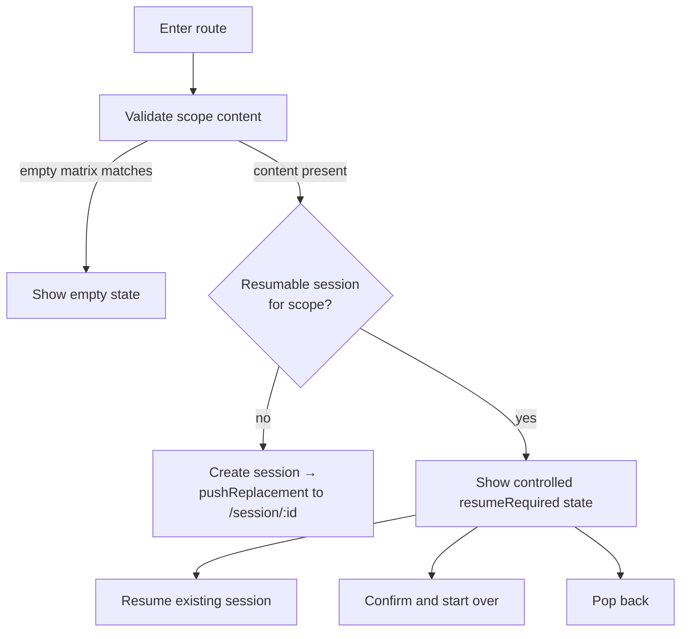

# 12 — Study Entry Gate

## Purpose

Pre-session screen. Validates scope, handles resume vs start-over, presents empty states, then
either redirects to existing session or creates a new one and navigates to it.

Most users never see this screen for more than a moment — it's a gate.

> Current V1 implementation note: the app now ships a real Study Entry screen for
> `/library/study/today` and `/library/study/:entryType/:entryRefId`. It parses
> `entryType`, `entryRefId`, `study_type`, and `mode`, shows a preparing state,
> surfaces invalid parameters as an error state, renders the empty-scope matrix
> for zero-eligible-card scopes, and redirects with `pushReplacement` to a
> persisted session when eligible cards exist. The destination
> `/library/study/session/:sessionId` now opens a real Study Session Review Screen V1 and
> `/library/study/session/:sessionId/result` opens the real result screen. If a resumable
> session already exists, V1 shows an explicit Resume / Start over / Back choice.

## Behavior tree



## Layout — most cases (transient)

This screen typically shows for < 500ms. Render a minimal loading placeholder:

```
┌───────────────────────────────────────┐
│                                       │
│                                       │
│              ⏳                        │
│       Preparing study...              │
│                                       │
│                                       │
└───────────────────────────────────────┘
```

If checks take longer (slow disk, large folder query), the placeholder remains until decision made.

## Layout — empty state matrix render

When scope is empty, this screen renders the appropriate empty state from
`docs/business/study/study-flow.md` matrix. Each l10n key gives slightly different copy.

### Variant — deck has zero cards

```
┌───────────────────────────────────────┐
│ ←   Korean N5                         │
├───────────────────────────────────────┤
│                                       │
│              🃏                        │
│                                       │
│      No cards in this deck.           │
│                                       │
│   Add flashcards to start studying.   │
│                                       │
│   [ + Add flashcards ]                │
│                                       │
└───────────────────────────────────────┘
```

### Variant — no due cards (srs_review path)

```
┌───────────────────────────────────────┐
│ ←   Korean N5                         │
├───────────────────────────────────────┤
│                                       │
│              ✓                         │
│                                       │
│      All caught up!                   │
│                                       │
│   Next due in 2 hours.                │
│                                       │
│   [ Study new instead ]               │
│                                       │
└───────────────────────────────────────┘
```

### Variant — today, no content at all

```
┌───────────────────────────────────────┐
│                                       │
│              🃏                        │
│                                       │
│   You haven't created any             │
│   flashcards yet.                     │
│                                       │
│   [ Create your first deck ]          │
│                                       │
└───────────────────────────────────────┘
```

### Variant — today, all done

```
┌───────────────────────────────────────┐
│                                       │
│              🎉                        │
│                                       │
│      All done for today!              │
│                                       │
│   🔥 7-day streak                     │
│                                       │
│   Come back tomorrow to keep it       │
│   going.                              │
│                                       │
│   [ Done ]                            │
│                                       │
└───────────────────────────────────────┘
```

### Variant — all buried

```
┌───────────────────────────────────────┐
│                                       │
│              🌙                        │
│                                       │
│   You buried all cards for today.     │
│                                       │
│   They'll return tomorrow.            │
│                                       │
│   [ Study new instead ]               │
│   [ Done ]                            │
│                                       │
└───────────────────────────────────────┘
```

### Variant — all suspended

```
┌───────────────────────────────────────┐
│                                       │
│              🔇                        │
│                                       │
│   All cards are suspended.            │
│                                       │
│   Resume some cards to study.         │
│                                       │
│   [ View suspended cards ]            │
│                                       │
└───────────────────────────────────────┘
```

### Variant — tag scope, no matching cards

```
┌───────────────────────────────────────┐
│                                       │
│              🏷                        │
│                                       │
│   No cards have all the selected      │
│   tags.                               │
│                                       │
│   [ Adjust tags ]                     │
│                                       │
└───────────────────────────────────────┘
```

## Inputs

| Param                      | Source | Notes                                                                                                                                                                                                                                                                                                                                                                                                                                                                                                                                                                     |
|----------------------------|--------|---------------------------------------------------------------------------------------------------------------------------------------------------------------------------------------------------------------------------------------------------------------------------------------------------------------------------------------------------------------------------------------------------------------------------------------------------------------------------------------------------------------------------------------------------------------------------|
| `entryType` (path param)   | URL    | one of `deck`, `folder`, `today`, `tag`. `today` is a literal route segment with no `entryRefId`.                                                                                                                                                                                                                                                                                                                                                                                                                                                                         |
| `entryRefId` (path param)  | URL    | required when entryType ∈ (`deck`, `folder`, `tag`); absent for `today`. For `tag`: sorted lowercased comma-joined names.                                                                                                                                                                                                                                                                                                                                                                                                                                                 |
| `study_type` (query param) | URL    | optional; values are `StudyType.storageValue` (`new` / `srs_review`). When absent the entry default applies (`deck`/`folder` → `new`, `today` → `srs_review`). Set to `srs_review` from the Folder Detail **Today** CTA (Current, Prompt 45) and the Flashcard List deck **Today** CTA (Current, Prompt 46) so a folder/deck scope reviews due cards. Parsed in `study_entry_screen.dart` (`_resolveStudyType`); routed via `RoutePaths.studyTypeQueryParam`. An unrecognized value fails fast (`ArgumentError`) and surfaces through the gate's existing error handling. |
| `mode` (query param)       | URL    | optional single `StudyMode.storageValue`; selects a single-mode flow.                                                                                                                                                                                                                                                                                                                                                                                                                                                                                                     |

## Data to load

| Data                                             | Source                                                       | Refresh trigger            |
|--------------------------------------------------|--------------------------------------------------------------|----------------------------|
| Scope resolution (does scope contain cards?)     | repository per entryType                                     | parallel with resume check |
| Empty-scope variant (which empty layout to show) | derived from scope content + study_type + bury/suspend state | once                       |
| Resumable session for scope                      | `study_sessions` matched on `(entry_type, entry_ref_id)`     | parallel                   |
| Currently active session (for redirect)          | follows resume check                                         | conditional                |

## Forbidden

- ❌ Skip the empty-scope check before creating a session. Even if it adds latency, prevent zero-card
  sessions.
- ❌ Show resume dialog AND empty state simultaneously. Resume takes precedence.
- ❌ Create session before user confirms resume-or-start-over.
- ❌ Use `push` for the happy-path session redirect. MUST be `pushReplacement` (this screen never
  stays in stack).
- ❌ Bypass this gate for "Study new instead" CTA. Re-route through gate with new flag.
- ❌ Treat empty-scope as an error. It's a normal flow with appropriate empty layout.

## States

| State                  | Trigger                                          | Behavior                                                                        |
|------------------------|--------------------------------------------------|---------------------------------------------------------------------------------|
| Preparing              | Default                                          | Minimal loading. Run scope check + resumable check in parallel.                 |
| Empty (matrix variant) | Scope check returns one of the matrix conditions | Render appropriate empty layout.                                                |
| Resume dialog          | Resumable session exists                         | Show dialog over loading placeholder.                                           |
| Auto-redirect          | No resumable, scope has content                  | Create session, `pushReplacement` to session route. Screen never shown to user. |
| Error                  | Validation/create failure                        | Inline error + back.                                                            |

## Actions

| Action                       | Trigger | Result                                                             |
|------------------------------|---------|--------------------------------------------------------------------|
| Back from any state          | Back    | Pop.                                                               |
| Tap "Add flashcards"         | Tap     | Push flashcard create.                                             |
| Tap "Study new instead"      | Tap     | Re-enter gate with `study_type = new` (route param flag or query). |
| Tap "Create your first deck" | Tap     | Push deck create from Library FAB sheet.                           |
| Tap "View suspended cards"   | Tap     | Push flashcard list filtered to suspended.                         |
| Tap "Adjust tags"            | Tap     | Open tag picker bottom-sheet pre-filled with current selection.    |
| Tap "Done" (today all-done)  | Tap     | Pop to Dashboard.                                                  |

## Dialogs and bottom-sheets used

- Resume-or-Start-over dialog — `docs/wireframes/24-shared-dialogs.md` §resume-or-start-over.
- Confirm discard previous session — `docs/wireframes/24-shared-dialogs.md` §discard-session.
- Tag picker (for "Adjust tags") — `docs/wireframes/25-shared-bottom-sheets.md` §tag-picker.

## Navigation in

- Dashboard "Start today's review" → `/library/study/today`.
- Dashboard "Start new learning" → scope picker → here.
- Deck "Study deck" CTA → `/library/study/deck/:deckId` (Current, Prompt 46; no explicit
  `study_type` → default new study).
- Deck "Today" CTA → `/library/study/deck/:deckId?study_type=srs_review` (Current, Prompt 46;
  deck-scoped due review, NOT global `entry_type=today`).
- Folder "Study folder" CTA → `/library/study/folder/:folderId` (Current, Prompt 45).
- Folder "Today" CTA → `/library/study/folder/:folderId?study_type=srs_review` (Current, Prompt 45;
  folder-scoped due review).
- Tag list "Study tag" action → `/library/study/tag/<lowercased,comma-joined>` (Future/Blocked; not
  exposed).
- "Continue" from Dashboard skips this gate (directly to `/library/study/session/:id`); the Folder
  Detail and Flashcard List Resume banners likewise open the existing session directly.

## Navigation out

- Auto-redirect to `/library/study/session/:sessionId` via `pushReplacement`.
- Back from any empty state → caller.
- Empty CTAs → respective screens.

## Responsive

- All layouts center-aligned. No layout shift on tablet.

## Performance

- Scope check and resumable check fire in parallel (both should be cheap indexed queries).
- This screen has ≤ 500ms latency budget for the happy path.
- Empty state render is cheap; just template + icon + l10n.

## Accessibility

- Loading placeholder announces "Preparing study session".
- Empty states have clear focus order: heading → primary CTA → secondary.

## Rules

- Auto-redirect uses `pushReplacement` so back goes to caller, not to this gate.
- Resume dialog blocks all other interaction; it's modal.
- Empty state mapping MUST match `docs/business/study/study-flow.md` empty scope matrix exactly (
  same l10n keys).
- Tag scope: validate that the comma-joined ref produces a non-empty card set before considering the
  scope valid.

## Agent rule

- Do NOT skip the empty scope check before creating a session. Even if it adds latency, prevent
  zero-card sessions.
- Do NOT show the resume dialog AND the empty state simultaneously. Resume takes precedence (resume
  is about existing session, empty is about new-session viability).
- This screen MUST NOT appear in browser history as a stop. Use `pushReplacement` for the happy
  path.
- "Study new instead" CTA path MUST re-route via this same gate with new flag, not bypass it.

## Implementation refs

**Business specs:**

- `docs/business/study/study-flow.md` (empty scope matrix)
- `docs/business/resume/resume-session.md` (resume-or-start-over)

**Decision rows:**

- S1-S4i (session creation, empty scope variants), Resume section

**Schema / storage:**

- READ scope content (flashcards by entry_type/entry_ref_id)
- READ resumable `study_sessions` by scope match
- INSERT `study_sessions` + `study_session_items` on commit

**Contracts:** `docs/contracts/usecase-contracts/study.md` §ResolveScopeUseCase,
§FindResumableSessionUseCase, §CreateSessionUseCase

**Code paths:**

- Screen: `lib/presentation/features/study/screens/study_entry_screen.dart` +
  `lib/presentation/features/study/providers/study_entry_notifier.dart`
  (`studyEntryProvider`), wired through
  `lib/presentation/features/study/routes/study_routes.dart`. There is no
  `study_entry_gate_screen.dart`.
- Current V1 behavior: parse and validate route params, show preparing/error
  states, and render an unsupported-gap empty state for valid routes until the
  session lifecycle layer lands. No session creation, resume dialog, or
  start-over dialog is wired in code yet.
- Target session lifecycle remains specified in
  `docs/business/study/study-flow.md` and
  `docs/business/resume/resume-session.md`.
- Route constants: `lib/app/router/route_names.dart` → `RouteNames.studyEntry`,
  `RouteNames.studyToday`.

**Related wireframes:**

- All 5 study mode wireframes 13-17
- `docs/wireframes/01-dashboard.md`, `docs/wireframes/05-folder-detail.md`,
  `docs/wireframes/06-flashcard-list.md` (callers)
- `docs/wireframes/24-shared-dialogs.md` §resume-or-start-over, §discard-session
- `docs/wireframes/25-shared-bottom-sheets.md` §tag-picker
